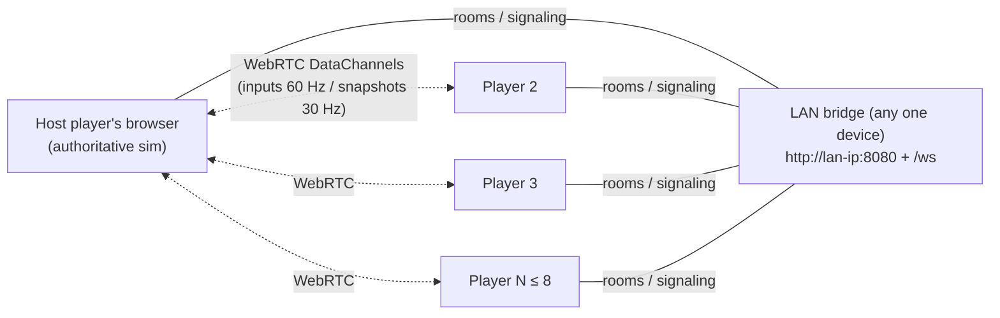

# Aerocade

**Aerocade** is an original, browser-native 2D side-view jetpack arena shooter for up to 8 players
over LAN — no internet, no cloud, no accounts. One device on the Wi-Fi runs a tiny "LAN bridge"
process; everyone else just opens a URL on their phone, tablet, or laptop and plays. The game is a
deterministic fixed-timestep simulation with client prediction, host-authoritative WebRTC
networking, and an installable PWA shell.

> **Originality and legal note.** Aerocade is inspired by the *feel* of 2014–2018 era jetpack arena
> shooters, but it is an entirely original work: all code, art, audio, maps, weapon names and
> tuning values, UI, and branding are created for this project. It contains no third-party game
> assets and is not affiliated with, or derived from, any existing commercial title.
> See [docs/DECISIONS.md](docs/DECISIONS.md) (ADR-001).

## Features

Honest status per milestone (full plan in [docs/roadmap.md](docs/roadmap.md)):

| Feature | Milestone | Status |
| --- | --- | --- |
| Deterministic 60 Hz sim core, ECS-lite pools, seeded RNG | M1 | Done |
| Local sandbox: run/jump/jetpack (with hover), aim, shoot, damage, respawn | M1 | Done |
| First map: **Foundry** (48×27 tile arena) + HUD | M1 | Done |
| LAN bridge, room discovery, WebRTC DataChannels + WebSocket relay fallback | M2 | Done |
| Client prediction, reconciliation, snapshot interpolation, Playwright e2e | M2 | Done |
| Full weapon roster, grenades, melee, pickups, lag compensation | M3 | In progress (Arclight Beam and Emberjet land in M3) |
| Match lifecycle: FFA/TDM/CTF, scoreboard, kill feed, timer, end screen | M4 | Planned |
| Mobile twin-stick controls, Gamepad API, settings, generated audio | M5 | Planned |
| PWA polish, more maps, moving platforms/jump pads, perf hardening | M6 | Planned |
| AI opponents, Survival waves, Training mode | M7 | Planned |
| Release hardening: soak tests, docs completion, packaging | M8 | Planned |

## Tech stack

| Layer | Technology |
| --- | --- |
| Simulation | Hand-rolled deterministic fixed-timestep engine (TypeScript, zero deps, no DOM) — see [docs/physics.md](docs/physics.md), [docs/ecs.md](docs/ecs.md) |
| Client | Vite 6 + React 19 (menus/HUD) + Phaser 3.87 (rendering only; Phaser physics disabled) — see [docs/rendering.md](docs/rendering.md), [docs/ui.md](docs/ui.md) |
| Networking | Host-authoritative star over WebRTC DataChannels, WebSocket relay fallback — see [docs/networking.md](docs/networking.md) |
| LAN bridge | Node 20 process: static PWA hosting + room discovery/signaling/relay; deliberately game-logic-free |
| Quality | Strict TypeScript, ESLint, Prettier, Vitest, Playwright (from M2) — see [docs/testing.md](docs/testing.md) |

## Quick start (development)

Requirements: **Node >= 20** and npm.

```bash
npm install       # install all workspaces
npm run dev       # client dev server (local sandbox play, hot reload)
npm run verify    # typecheck + lint + tests + build — must be green before every commit
```

Workspace layout (npm workspaces monorepo):

| Package | Path | Purpose |
| --- | --- | --- |
| `@aerocade/shared` | `packages/shared` | Deterministic sim, ECS-lite, protocol, math. Zero runtime deps, no DOM. Runs identically in host browser, client browsers, and Node. |
| `@aerocade/client` | `packages/client` | The PWA. React owns DOM UI, Phaser owns the canvas. Depends on `shared`. |
| `@aerocade/server` | `packages/server` | The LAN bridge: serves the built PWA and a WebSocket at `/ws` for rooms/signaling/relay. Depends on `shared`. |

Architecture overview: [docs/architecture.md](docs/architecture.md).

## Local hosting guide

To actually host games (as opposed to the dev sandbox), build the PWA and run the bridge:

```bash
npm run build        # builds shared, client (static PWA), and server
npm run dev:server   # start the LAN bridge from the repo
# or, without cloning the repo:
npx aerocade-lan
```

The bridge prints the join URL on startup, e.g.:

```
Aerocade LAN bridge listening — open http://192.168.1.42:8080 on any device on this network
```

What the bridge does — and deliberately does not do:

- Serves the built PWA at `http://<lan-ip>:8080` to every device on the network.
- Hosts a WebSocket at `/ws` for room discovery, WebRTC signaling, and message relay fallback.
- Runs **zero game logic**. The *host player's browser* owns the authoritative simulation, so any
  phone or laptop can be the game host; the bridge is just the meeting point browsers cannot
  provide themselves (browsers cannot listen on sockets, broadcast, or query mDNS — ADR-006).

## LAN party guide



1. Put every device on the **same Wi-Fi network or phone hotspot**. No internet required.
2. On one machine, run the bridge: `npx aerocade-lan` (or `npm run dev:server` from the repo).
3. Everyone opens the printed `http://<lan-ip>:8080` URL. The bridge page also shows a **QR code**
   so phones can join with one scan.
4. One player taps **Create Room** — their browser becomes the game host.
5. Everyone else sees the room in the **room browser** (auto-discovered via the bridge) and joins.
   If discovery misbehaves, type the bridge's `ip:port` manually — that is the designed fallback.
6. Play. Game traffic runs peer-to-peer over WebRTC where possible and silently falls back to
   WebSocket relay through the bridge where not.

### Troubleshooting

| Symptom | Cause | Fix |
| --- | --- | --- |
| Page loads but nobody can join / rooms never appear | Access point **client isolation** (common on guest/office Wi-Fi) blocks device-to-device traffic | Use a phone hotspot or a home router; disable "AP/client isolation" if you control the AP |
| Other devices cannot open the URL at all | OS firewall on the bridge machine blocks inbound **port 8080** | Allow inbound TCP 8080 (e.g. `ufw allow 8080/tcp`), or run the bridge on an open port via `PORT=` |
| iOS: plays in Safari, but offline install features missing | iOS treats plain-HTTP LAN origins as insecure; service-worker features are restricted over `http://` | Play in the Safari tab (fully supported); install the PWA from `http://localhost:8080` on a machine running the bridge for full offline mode |
| Game ends when one specific player leaves | That player was the **host**; host migration is **not supported in v1** | Have the most stable device/browser create the room; restart the room if the host drops |
| Joins work but gameplay is choppy for one player | WebRTC failed for that client; they are on the WebSocket relay fallback | Expected degradation path — playable on LAN; check AP isolation to restore direct RTC |

## PWA installation and offline play

Aerocade is a PWA: the entire app shell is precached, and settings/keybinds/player name persist in
IndexedDB. Browsers require a secure context (or `localhost`) for service-worker installation, so
install from `http://localhost:8080` while the bridge runs on that device:

- **Android (Chrome/Edge):** open the game, browser menu → **Install app** (or the install prompt).
- **iOS (Safari):** Share → **Add to Home Screen**. Note the HTTP quirk in the table above.
- **Desktop (Chrome/Edge):** click the install icon in the address bar → **Install**.

Offline capabilities, precisely:

- **Training and Survival** (M7) run fully offline — no bridge, no network at all.
- **LAN multiplayer** needs only the bridge on the local network. **Nothing ever requires the
  internet:** no accounts, no telemetry, no cloud. See [docs/security.md](docs/security.md).

## Controls

### Desktop

| Input | Action |
| --- | --- |
| `W A S D` | Move |
| Mouse | Aim |
| Left mouse button | Shoot |
| Right mouse button | Melee (Spanner Strike) |
| `Space` | Jetpack |
| `G` | Throw frag grenade |
| `R` | Reload |
| `Q` | Switch weapon |
| `Tab` | Scoreboard |
| `Esc` | Pause |

### Mobile (twin virtual sticks, M5)

| Input | Action |
| --- | --- |
| Left stick | Move |
| Right stick | Aim; fires automatically once pushed past the deadzone threshold |
| Jetpack button | Jetpack |
| Grenade button | Throw frag grenade |
| Reload button | Reload |
| Switch button | Switch weapon |
| Melee button | Melee (Spanner Strike) |

### Gamepad (Gamepad API, standard mapping, M5)

| Input | Action |
| --- | --- |
| Left stick | Move |
| Right stick | Aim |
| Right trigger | Shoot |
| Left trigger | Jetpack |
| Right bumper | Melee |
| Left bumper | Grenade |
| `X` / `Y` | Reload / switch weapon |
| Select / Start | Scoreboard / pause |

## Deployment guide

`npm run build` produces two artifacts:

- `packages/client/dist/` — the static PWA (HTML, JS, precache manifest, generated icons).
- `packages/server/dist/` — the bridge, runnable with plain Node 20:
  `node packages/server/dist/index.js` (also published as the `aerocade-lan` bin for `npx`).

Configuration is by environment variable:

| Variable | Default | Purpose |
| --- | --- | --- |
| `PORT` | `8080` | HTTP + WebSocket listen port for the bridge |

To keep a bridge running permanently on a spare machine (e.g. a living-room mini PC), a minimal
systemd unit:

```ini
# /etc/systemd/system/aerocade.service
[Unit]
Description=Aerocade LAN bridge
After=network-online.target

[Service]
ExecStart=/usr/bin/node /opt/aerocade/packages/server/dist/index.js
Environment=PORT=8080
Restart=on-failure
User=aerocade

[Install]
WantedBy=multi-user.target
```

```bash
sudo systemctl enable --now aerocade
```

The bridge is stateless (rooms live in memory), so restarts are cheap; players simply recreate the
room. Performance budgets and tuning targets: [docs/performance.md](docs/performance.md).

## Documentation

| Doc | Contents |
| --- | --- |
| [docs/architecture.md](docs/architecture.md) | System overview, package boundaries, data flow |
| [docs/DECISIONS.md](docs/DECISIONS.md) | Architecture decision record — the source of truth |
| [docs/ecs.md](docs/ecs.md) | ECS-lite: pools, components, system order |
| [docs/physics.md](docs/physics.md) | Fixed-timestep physics, AABB/tile collision, tuning |
| [docs/networking.md](docs/networking.md) | Transports, protocol, prediction/reconciliation, lag compensation |
| [docs/rendering.md](docs/rendering.md) | Phaser integration, interpolation, camera |
| [docs/ui.md](docs/ui.md) | React shell, HUD, menus, input mapping |
| [docs/testing.md](docs/testing.md) | Vitest/Playwright strategy, determinism tests |
| [docs/performance.md](docs/performance.md) | Budgets, zero-allocation rules, profiling |
| [docs/security.md](docs/security.md) | LAN threat model, input validation, no-internet posture |
| [docs/roadmap.md](docs/roadmap.md) | Milestones M0–M8 in detail |

## Contributing

Read [docs/DECISIONS.md](docs/DECISIONS.md) before proposing changes — every structural decision
(custom physics over Matter.js, host-authoritative networking, determinism rules) is recorded
there with its rationale, and new work must be consistent with it or add a superseding ADR.
`npm run verify` (typecheck + lint + tests + build) must pass before every commit.

## License

MIT — see [LICENSE](LICENSE).
