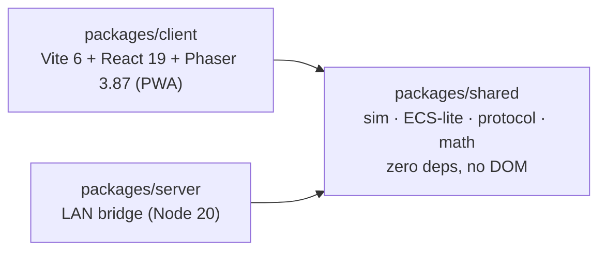
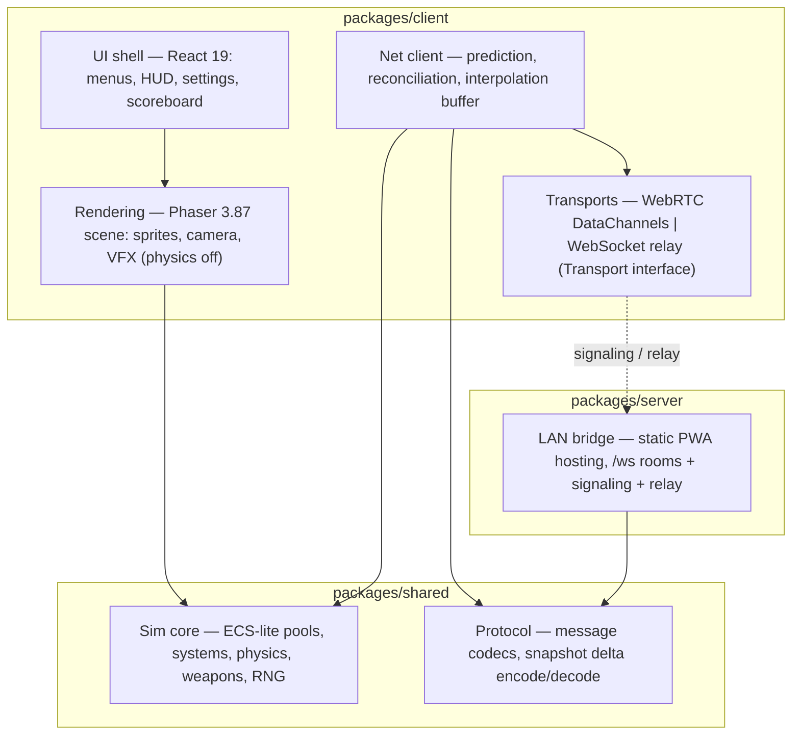
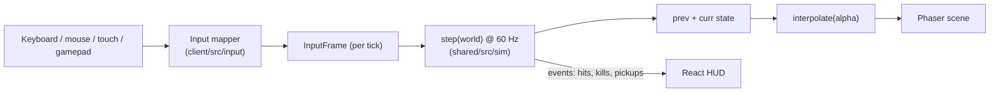
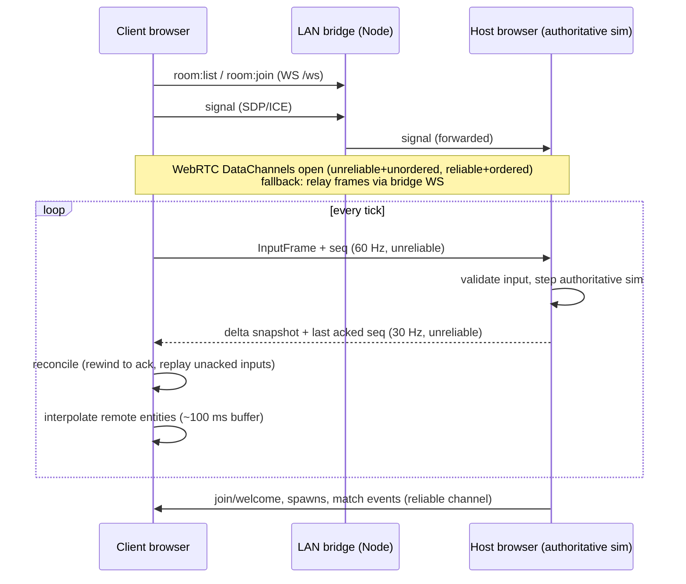

# Aerocade — Architecture

Aerocade is an original browser-based 2D side-view jetpack arena shooter, playable over LAN as a PWA with no internet, no cloud, and no accounts. This document describes the overall system architecture: the three-package monorepo, the layering that keeps the deterministic simulation isolated from rendering and networking, the fixed-timestep loop, data flow for local and networked play, the full repository layout, and the invariants every contributor must uphold. It is the entry point to the sibling specs listed at the end; the rationale behind each decision lives in [DECISIONS.md](DECISIONS.md).

## 1. Goals and non-goals

### Goals

- **Deterministic, replayable simulation.** The same inputs from the same snapshot produce the same state — the foundation for client prediction, reconciliation, and lag compensation (ADR-003, ADR-009).
- **LAN-first multiplayer with zero infrastructure.** One device runs the bridge; up to 8 players join from any modern browser on the Wi-Fi. No internet, no signup, no certificates.
- **Host-in-browser authority.** Any player's browser — including a phone — can host the authoritative sim. The Node bridge stays game-logic-free (ADR-006).
- **Smooth on mid-range Android.** Zero allocation during a match, fixed pools, interpolated rendering at display rate.
- **Original everything, with one recorded exception.** All art, maps, tuning values, names and UI are
  original works (ADR-001). Audio is original synthesis _plus_ a licensed sample pack layered over it
  for the weapons (ADR-030); the synthesis remains the fallback for every sound, so the game is still
  fully playable on original assets alone.

### Non-goals

- No internet matchmaking, accounts, persistence beyond local settings, or anti-cheat beyond host-side input validation.
- No dedicated-server binary in scope (the shared sim is Node-capable by construction, so one remains _possible_ later).
- No general-purpose physics: AABBs vs. a static tile grid, rays, swept movement, and circle overlaps are the entire collision vocabulary (ADR-003).
- No cross-machine lockstep determinism — the host is the single source of truth; prediction errors are reconciled (ADR-009).

## 2. Packages and the dependency rule

npm workspaces, three packages, one rule:



| Package  | Runs in                                                  | Depends on                      | Must never                                                                                  |
| -------- | -------------------------------------------------------- | ------------------------------- | ------------------------------------------------------------------------------------------- |
| `shared` | Host browser, client browsers (prediction), Node (tests) | **nothing** (zero runtime deps) | import DOM, Phaser, React, or Node built-ins; touch `Math.random`/`Date.now` inside the sim |
| `client` | Browser                                                  | `shared`                        | put game rules in React or Phaser; enable Phaser physics                                    |
| `server` | Node 20                                                  | `shared` (protocol types only)  | simulate gameplay, inspect game state, or hold authority                                    |

The dependency rule is directional and absolute: `shared` imports nothing, `client` and `server` import `shared`, and `client`/`server` never import each other. ESLint enforces the boundary (`no-restricted-imports` denies `phaser`, `react`, and DOM globals inside `packages/shared`).

Phaser is a **renderer only** — its Arcade/Matter physics are disabled and never instantiated. React owns DOM chrome (menus, HUD, settings); Phaser owns the canvas; the sim owns the truth.

## 3. Layered view



| Layer      | Home                       | Responsibility                                                                                                                            |
| ---------- | -------------------------- | ----------------------------------------------------------------------------------------------------------------------------------------- |
| Sim core   | `shared/src/sim`           | Fixed 60 Hz deterministic step; all gameplay rules; snapshot/restore                                                                      |
| Protocol   | `shared/src/protocol`      | Wire formats: input frames, delta snapshots, reliable events; bridge JSON messages                                                        |
| Transports | `client/src/net/transport` | `Transport` interface with WebRTC and WS-relay implementations; the game never knows which is active                                      |
| Net client | `client/src/net`           | Prediction, input-seq acking + replay, ~100 ms interpolation buffer, ≤120 ms extrapolation                                                |
| Rendering  | `client/src/render`        | Phaser scene reading interpolated sim state; no writes into sim                                                                           |
| UI shell   | `client/src/ui`            | React menus/HUD; talks to the game via a thin store, never to the sim directly                                                            |
| Bridge     | `server/src`               | Serve built PWA at `http://<lan-ip>:8080`; `/ws` for `hello`, `room:create`, `room:list`, `room:join`, `signal`, `relay`, `error`, `pong` |

See [networking.md](networking.md) for transport and protocol detail, [rendering.md](rendering.md) and [ui.md](ui.md) for the client layers, [ecs.md](ecs.md) and [physics.md](physics.md) for the sim core.

## 4. The fixed-timestep loop

The sim advances only in whole ticks of `SIM_DT = 1/60` s (ADR-004). The client's `requestAnimationFrame` loop feeds an accumulator; rendering runs at display rate and interpolates.

```
loop (rAF, dt = wall-clock delta, clamped to 250 ms):
  accumulator += dt
  while accumulator >= SIM_DT:
    prevState.copyFrom(currState)        // typed-array copies
    step(world, inputs)                   // one deterministic tick
    accumulator -= SIM_DT
  alpha = accumulator / SIM_DT
  render(lerp(prevState, currState, alpha))
```

Key properties:

- **No variable-dt physics anywhere.** A 144 Hz display runs more render frames, not different physics; a hitching device runs catch-up ticks, not larger ones.
- **The clamp** (250 ms) prevents a spiral of death after a background-tab freeze; the match clock is `tick * SIM_DT`, never wall time.
- **System order is fixed:** `input → movement → physics → weapons → projectiles → damage → pickups → respawn → match` (ADR-005). Reordering systems changes simulation results and is a breaking change.
- **Networked rendering** replaces `lerp(prev, curr)` for remote entities with interpolation across the snapshot buffer (~100 ms behind host time); the local player renders from the predicted state. See [networking.md](networking.md).

## 5. Data flow

### Local play (sandbox / Training / Survival)



One `SimWorld`, one loop, no network. This path is the M1 milestone and remains the offline PWA mode forever.

### Networked play (M2+, host-authoritative star)



The bridge appears only for rendezvous and (if RTC fails) as a dumb byte relay — it never parses game traffic beyond routing `relay` envelopes. Hitscan fairness uses the host's 64-tick rewind ring (lag compensation); details in [networking.md](networking.md).

## 6. Repository layout

```
aerocade/
├── README.md
├── package.json                  # npm workspaces root; verify/lint/test scripts
├── tsconfig.base.json
├── docs/
│   ├── DECISIONS.md              # ADRs (authoritative rationale)
│   ├── architecture.md           # this file
│   ├── networking.md  physics.md  ecs.md  rendering.md  ui.md
│   ├── testing.md  performance.md  security.md  roadmap.md
├── packages/
│   ├── shared/
│   │   └── src/
│   │       ├── math/             # vec2, aabb, rng (mulberry32), fixed helpers
│   │       ├── sim/
│   │       │   ├── world.ts      # SimWorld: pools, tick, rng — all state
│   │       │   ├── tuning.ts     # every gameplay constant (ADR-008)
│   │       │   ├── step.ts       # fixed system order dispatcher
│   │       │   ├── pools/        # players×8, projectiles×256, pickups×64 (SoA)
│   │       │   ├── systems/      # input, movement, physics, weapons, projectiles,
│   │       │   │                 # damage, pickups, respawn, match
│   │       │   ├── combat/       # weapon-defs.ts, spread, falloff, splash
│   │       │   ├── map/          # tile grid, map format, spawn points ("Foundry")
│   │       │   └── snapshot.ts   # typed-array copy/restore, delta encode support
│   │       └── protocol/         # message ids, codecs, bridge JSON message types
│   ├── client/
│   │   ├── vite.config.ts        # Vite 6 + vite-plugin-pwa (Workbox)
│   │   └── src/
│   │       ├── main.tsx          # React 19 shell mount
│   │       ├── ui/               # menus, HUD, scoreboard, settings (DOM)
│   │       ├── render/           # Phaser 3.87 scene, camera, VFX (physics off)
│   │       ├── input/            # keyboard/mouse, twin virtual sticks, Gamepad API
│   │       ├── net/
│   │       │   ├── transport/    # Transport interface; rtc.ts, ws-relay.ts
│   │       │   ├── prediction.ts # local replay + reconciliation
│   │       │   └── interp.ts     # snapshot buffer, extrapolation cap
│   │       ├── game/             # loop.ts (accumulator), local/host/client drivers
│   │       └── storage/          # IndexedDB: settings, keybinds, player name
│   └── server/
│       └── src/
│           ├── index.ts          # aerocade-lan entry: static hosting :8080
│           ├── rooms.ts          # room registry (create/list/join)
│           ├── signaling.ts      # SDP/ICE forwarding
│           └── relay.ts          # WS fallback frame routing
└── e2e/                          # Playwright (from M2): bridge + 2 contexts
```

## 7. Module responsibilities

| Module                                           | Owns                                                                                            | Never does                                           |
| ------------------------------------------------ | ----------------------------------------------------------------------------------------------- | ---------------------------------------------------- |
| `shared/math`                                    | Deterministic vec/AABB ops, seeded `Rng`                                                        | Allocation in hot paths                              |
| `shared/sim/world.ts`                            | All mutable game state in one value                                                             | Global/module-level mutable state                    |
| `shared/sim/tuning.ts` + `combat/weapon-defs.ts` | Every constant (health 100, run 7.4 m/s, gravity 21 m/s², jetpack burn 46/s, all weapon values) | Magic numbers hiding in systems                      |
| `shared/sim/systems/*`                           | Pure `(world) => void` gameplay rules                                                           | I/O, DOM, timers, randomness outside `world.rng`     |
| `shared/protocol`                                | Wire encode/decode, versioned message ids                                                       | Interpreting game rules                              |
| `client/game`                                    | Accumulator loop; local/host/client drivers                                                     | Physics math (delegates to `shared`)                 |
| `client/net`                                     | Prediction, reconciliation, interpolation                                                       | Trusting its own sim over host snapshots             |
| `client/render`                                  | Drawing interpolated state                                                                      | Mutating `SimWorld`                                  |
| `client/ui`                                      | React DOM chrome                                                                                | Direct sim access (goes through the game store)      |
| `server`                                         | Hosting, rooms, signaling, relay                                                                | Reading game state; deciding anything about gameplay |

## 8. Key invariants

1. **Determinism** (ADR-009): sim randomness only via `world.rng` (mulberry32); time only via `tick * SIM_DT`; entity iteration always by ascending index; no `Math.random`, `Date.now`, or wall clock inside `packages/shared/src/sim`.
2. **Zero-allocation gameplay** (ADR-004): pools are preallocated struct-of-arrays (players ×8, projectiles ×256, pickups ×64); a tick allocates nothing; snapshots are `TypedArray.set()` copies. New objects during a match are a performance bug.
3. **No global mutable state** (ADR-005): everything hangs off a `SimWorld` value, so multiple worlds coexist in one process (host sim + predicted client sim, or parallel tests).
4. **Fixed system order**: the nine-system pipeline is part of the deterministic contract; insertions go at an explicit position with a test asserting the order.
5. **Renderer reads, never writes**: Phaser and React consume interpolated state and emitted events; input reaches the sim only as `InputFrame`s through the input system.
6. **Bridge stays dumb**: any PR adding game awareness to `packages/server` is architecturally wrong by definition (ADR-006).
7. **Verify gate**: `npm run verify` (typecheck + lint + Vitest + build) green before every commit (ADR-010); Playwright e2e joins the gate at M2.

## 9. Extension points

- **Weapons.** A weapon is a data row in `sim/combat/weapon-defs.ts` (damage, cycle, mag, spread, projectile vs. hitscan, splash radius, knockback) plus, only when its behavior is genuinely novel, a branch in the weapons/projectiles systems keyed by weapon id. The M3 additions (Arclight Beam, Emberjet) follow this path: new defs, one new projectile behavior each, zero renderer coupling beyond a sprite/VFX mapping table in `client/render`.
- **Game modes.** The `match` system delegates to a mode ruleset — a small object of pure hooks (`onKill`, `onPickup`, `onTick`, `isMatchOver`, scoring) resolved by mode id. FFA and TDM are the first rulesets; CTF adds a flag entity in the pickups pool plus its ruleset; Survival adds an AI-input source that fills `InputFrame`s for wave entities — the sim pipeline is unchanged. See [roadmap.md](roadmap.md) for sequencing.
- **Maps.** Maps are data (tile grid, spawn points, pickup placements) in `sim/map`; "Foundry" (48×27) defines the format. New maps ship as data files with no code changes.
- **Transports.** Anything implementing the `Transport` interface (connect, send-unreliable, send-reliable, events) can carry the protocol; WebRTC and WS-relay are the two shipped implementations.

## 10. Sibling documents

| Doc                              | Covers                                                                             |
| -------------------------------- | ---------------------------------------------------------------------------------- |
| [DECISIONS.md](DECISIONS.md)     | Authoritative ADRs and milestone plan                                              |
| [networking.md](networking.md)   | Transports, protocol, prediction/reconciliation, lag compensation, bridge messages |
| [physics.md](physics.md)         | Tile collision, swept AABB, rays, explosions, movement/jetpack tuning              |
| [ecs.md](ecs.md)                 | Pools, components, systems, snapshot mechanics                                     |
| [rendering.md](rendering.md)     | Phaser scene structure, interpolation, camera, VFX                                 |
| [ui.md](ui.md)                   | React shell, HUD, menus, input mapping (desktop/mobile/gamepad)                    |
| [testing.md](testing.md)         | Vitest/Playwright strategy, determinism tests, `npm run verify`                    |
| [performance.md](performance.md) | Allocation budget, profiling, mid-range mobile targets                             |
| [security.md](security.md)       | LAN threat model, host-side input validation, bridge hardening                     |
| [roadmap.md](roadmap.md)         | M0–M8 milestones and mode/weapon rollout                                           |
| [../README.md](../README.md)     | Quick start: run the bridge, join a game                                           |
