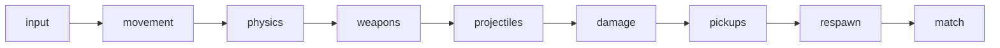

# ECS Design — Pooled Struct-of-Arrays Simulation

Aerocade's simulation core (`packages/shared`) uses an **ECS-lite** architecture: entities are
integer indices into fixed-capacity pools, components are parallel typed arrays, and systems are
pure functions run in a fixed deterministic order at 60 Hz ([ADR-005](DECISIONS.md)). This
document explains why we chose this over a generic archetype ECS, specifies the entity id scheme
and component layout, catalogs every system with its reads and writes, describes the typed-array
snapshot mechanism that powers reconciliation replay and lag-compensation rewind, and sets the
rules for extending the design without breaking determinism or the zero-allocation guarantee.
Companion docs: [architecture.md](architecture.md), [physics.md](physics.md),
[networking.md](networking.md), [performance.md](performance.md), [testing.md](testing.md).

## 1. Why ECS-lite, not a generic archetype ECS

ADR-005 in [DECISIONS.md](DECISIONS.md) fixes this decision. Summary of the reasoning:

Aerocade's entire live state is bounded and known at compile time: at most 8 players, 256
projectiles, and 64 pickups — a few hundred entities, each with a stable component set. A
generic archetype ECS (archetype tables, query caches, component registration, entity moves
between archetypes) earns its complexity when entity *shapes* vary at runtime and counts reach
tens of thousands. At our scale it adds indirection, allocation, and API surface while buying
nothing we need. What we *do* need, it makes harder:

| Requirement | ECS-lite (pooled SoA) | Generic archetype ECS |
| --- | --- | --- |
| Snapshot a tick | A few `TypedArray.set()` calls, O(state size), zero alloc | Walk archetype tables, serialize, usually allocates |
| Restore + replay (reconciliation) | Bitwise-exact restore, replay is identical | Restore fidelity depends on library internals |
| 64-tick rewind ring (lag comp) | 64 preallocated buffers, `set()` per tick | Impractical without custom serialization anyway |
| Deterministic iteration | Ascending index, guaranteed (ADR-009) | Archetype/table order is an implementation detail |
| Zero alloc during match | Trivially auditable — pools exist at boot | Fights the library's entity churn |
| Runs in browser *and* Node with zero deps | Plain TS, no DOM/node types | Adds a runtime dependency to `shared` |

The trade-off: we give up dynamic component composition. A "player" always has all player
components; an unused field costs a few bytes of preallocated array. That is the right trade for
a game whose design doc already enumerates every entity kind.

## 2. Entity id scheme

An entity id is a **plain integer index** into its kind's pool, paired with an `alive` flag
stored in the pool itself. There are no handles, wrappers, or generation counters.

| Pool | Capacity | Id range | Sizing rationale |
| --- | --- | --- | --- |
| `players` | 8 | 0–7 | Room cap per ADR-006 (host-authoritative star, 8 players) |
| `projectiles` | 256 | 0–255 | Worst case: 8 players sustaining Vortex SMG + in-flight Thumper/Lobber/Frag rounds, with headroom |
| `pickups` | 64 | 0–63 | Upper bound on spawner count for a 48×27 map ("Foundry") and successors |

Rules:

- **Spawn** = linear scan for the lowest index with `alive[i] === 0`, set fields, set
  `alive[i] = 1`. Lowest-index-first keeps spawning deterministic (ADR-009).
- **Despawn** = `alive[i] = 0`. Nothing is cleared eagerly; the slot's data is garbage until the
  next spawn fully reinitializes it. Spawn functions must therefore write *every* component
  field — there is no zero-on-free.
- **Slot reuse hazard**: an index held across ticks may come to refer to a different entity.
  The mitigation is a rule, not a mechanism: systems never carry raw indices across ticks except
  for semantically stable references (e.g. `projectiles.ownerId` — if that player slot dies and
  respawns it is still the same player, which is the semantics kill credit wants). Anything else
  must be revalidated against `alive` at point of use. Generation counters were considered and
  rejected: at 8/256/64 capacity the rule is auditable, and counters would bloat snapshots.
- Player slot indices double as network player ids: slot assignment happens once at join, on the
  reliable channel (see [networking.md](networking.md)).

## 3. Component layout: parallel typed arrays

Components are **struct-of-arrays**: one typed array per field, indexed by entity id. This keeps
snapshots trivial, iteration cache-friendly, and the whole state enumerable for the snapshot
codec. Concrete sketch of the player pool (field list abridged; the real file is
`packages/shared/src/sim/pools/player-pool.ts`):

```ts
export const MAX_PLAYERS = 8;

/** All state for up to 8 players. Allocated once at boot; never resized. */
export interface PlayerPool {
  alive: Uint8Array;            // 1 = slot occupied by a connected player

  // Transform — meters, meters/second, radians (1 tile = 1 m, ADR-008)
  posX: Float32Array;  posY: Float32Array;
  velX: Float32Array;  velY: Float32Array;
  aimAngle: Float32Array;

  // Movement / jetpack
  grounded: Uint8Array;
  fuel: Float32Array;           // 0..100
  fuelRegenDelay: Float32Array; // seconds until regen resumes (0.6 s after burn)
  hovering: Uint8Array;         // hover-modulation active this tick

  // Combat
  health: Float32Array;         // 0..100
  dead: Uint8Array;
  weaponId: Uint8Array;         // index into WEAPON_DEFS (sim/combat/weapon-defs.ts)
  mag: Uint16Array;             // rounds in current magazine
  reloadTimer: Float32Array;    // >0 while reloading
  fireCooldown: Float32Array;   // >0 while weapon cycling
  grenadeCooldown: Float32Array;
  respawnTimer: Float32Array;   // counts down 3.0 s while dead
  spawnProtection: Float32Array;// counts down from 2.5 s; zeroed on fire

  // Sampled input for this tick — written ONLY by inputSystem
  inMoveX: Float32Array;        // -1..1
  inAimAngle: Float32Array;
  inButtons: Uint8Array;        // bitfield: FIRE|JET|MELEE|GRENADE|RELOAD|SWITCH|JUMP

  // Scoring (match system owns these)
  kills: Uint16Array;  deaths: Uint16Array;
}

export function createPlayerPool(): PlayerPool {
  return {
    alive: new Uint8Array(MAX_PLAYERS),
    posX: new Float32Array(MAX_PLAYERS), posY: new Float32Array(MAX_PLAYERS),
    velX: new Float32Array(MAX_PLAYERS), velY: new Float32Array(MAX_PLAYERS),
    // ... one `new TypedArray(MAX_PLAYERS)` per field, nothing else, ever
  } as PlayerPool;
}
```

`projectiles` and `pickups` follow the same pattern with their own fields (`projectiles`: pos,
vel, ownerId, weaponId, fuseTimer, restitution flag; `pickups`: spawnerId, kind, respawnTimer,
active). Notes:

- **Float32 everywhere for continuous state.** Systems compute in JS doubles, but every value
  round-trips through a `Float32Array` each tick. Because the *stored* representation is what
  snapshots copy bitwise, restore-then-replay is exactly reproducible — which is the practical
  determinism ADR-009 asks for. Float32 also halves snapshot size on the wire.
- Everything hangs off one `SimWorld` value — no module-level mutable state:

```ts
export interface SimWorld {
  tick: number;
  rng: Rng;                     // mulberry32, seeded in the welcome message
  players: PlayerPool;
  projectiles: ProjectilePool;
  pickups: PickupPool;
  map: TileMap;                 // static after load; NOT in snapshots
  events: EventQueues;          // preallocated ring buffers, drained per tick
}
```

- **Event queues** (damage, kill, sound/vfx-out) are preallocated ring buffers of typed fields,
  written by earlier systems and drained by later systems (or by the renderer, for the outbound
  queue) in FIFO order within the same tick. They are the only sanctioned way for systems to
  communicate besides the pools themselves.

## 4. System catalog

`stepSim(world, inputs)` runs exactly these systems, in exactly this order, once per tick
(ADR-005). Order is load-bearing: e.g. `damage` must see every damage event that `weapons` and
`projectiles` enqueued *this* tick, and `respawn` must run after `damage` so a death and its
3-second timer start on the same tick.



| # | System | Reads | Writes | Notes |
| --- | --- | --- | --- | --- |
| 1 | `input` | per-tick input commands (host: validated net inputs; local: device sampler) | `players.in*` | Only system that touches `in*` fields; clamps/sanitizes ranges |
| 2 | `movement` | `in*`, `grounded`, `fuel`, `dead`, tuning | `velX/velY`, `fuel`, `fuelRegenDelay`, `hovering` | Run/walk accel, friction, jump, jetpack thrust + hover modulation, fuel burn/regen |
| 3 | `physics` | `velX/velY`, `posX/posY`, `map` | `posX/posY`, `velX/velY`, `grounded` | Gravity 21 m/s², fall clamp 26 m/s, swept AABB vs tile grid — see [physics.md](physics.md) |
| 4 | `weapons` | `in*`, `aimAngle`, `mag`, cooldowns, `spawnProtection`, weapon defs, `rng` (spread) | cooldowns, `mag`, `reloadTimer`, `weaponId`, `spawnProtection`, spawns into `projectiles`, damage events | Hitscan resolves here (host: against the rewind ring); firing clears spawn protection |
| 5 | `projectiles` | `projectiles.*`, `players.pos*`, `map` | `projectiles.*` (integrate, fuse, despawn), damage events | Arcing gravity for Lobber/Frag, bounce restitution, splash overlap queries |
| 6 | `damage` | damage event queue, `spawnProtection`, `health` | `health`, `velX/velY` (knockback), `dead`, kill events | Self-splash enables rocket-jumps; spawn-protected targets take zero damage |
| 7 | `pickups` | `pickups.*`, `players.pos*`, `health`, `mag` | `pickups.*` (consume, respawnTimer), `health`, `mag`, `weaponId` | AABB-vs-point overlap, ascending player index on contested grabs |
| 8 | `respawn` | `dead`, `respawnTimer`, map spawn points, `rng` (spawn choice) | `respawnTimer`, full player-slot reinit, `spawnProtection` | Resets health 100 / fuel 100 / default weapon at a spawn point |
| 9 | `match` | kill events, `world.tick`, mode config | `kills`, `deaths`, match phase/timers, feed events (outbound queue) | FFA/TDM first; CTF/Survival slot in here per the [roadmap](roadmap.md) |

Every system is a pure function `(world: SimWorld) => void` — "pure" meaning: mutates only
`world`, reads only `world` and immutable tuning constants, allocates nothing, and never touches
the DOM, the clock, or `Math.random` (ADR-009). All iteration is by ascending entity index.

## 5. Snapshots: typed-array copy, restore, and why it matters

A snapshot is a **bitwise copy of every dynamic typed array** in the world (plus scalars: `tick`,
RNG state, match phase). The map and weapon defs are static and excluded. Because state is SoA,
the entire operation is a flat list of `set()` calls into preallocated destination buffers:

```ts
export function copyWorld(src: SimWorld, dst: WorldBuffers): void {
  dst.tick = src.tick;
  dst.rngState = src.rng.state;
  dst.players.posX.set(src.players.posX);   // ... one line per array,
  dst.players.posY.set(src.players.posY);   // generated from a single
  /* ...every pool, every field... */        // field manifest (see §7)
}
export function restoreWorld(src: WorldBuffers, dst: SimWorld): void {
  /* identical list, direction reversed */
}
```

No serialization format, no object graph walk, no allocation, ~10 µs for the full world. This
one primitive powers three features (details in [networking.md](networking.md)):

1. **Client prediction + reconciliation.** The client keeps a ring of predicted states keyed by
   tick. When a host snapshot acks input sequence *n*, the client restores its state buffer,
   overwrites it with the authoritative data, then **replays** inputs *n+1…now* through the very
   same `stepSim`. Replay is trustworthy *only because* restore is bitwise-exact and systems are
   deterministic — the same starting bits and the same inputs must produce the same ending bits.
2. **Lag-compensation rewind.** The host keeps a **64-slot ring** of per-tick snapshots
   (preallocated at boot: 64 × full world buffers). To validate a hitscan shot fired ~k ticks
   ago from the shooter's point of view, `weapons` reads player AABBs directly out of ring slot
   `(tick - k) & 63` — no restore needed, the ring is just addressable history.
3. **Network snapshots.** The 30 Hz delta-encoded state broadcast diffs the current arrays
   against the last acked copy — again just typed-array comparisons.

Snapshot round-trip identity (`restore(copy(w))` step N ticks ≡ step N ticks directly) is a
standing Vitest invariant test — see [testing.md](testing.md).

## 6. Allocation policy

**Zero allocation during a match.** No `new`, no object/array/closure literals, no string
building, no `map`/`filter`/spread inside `stepSim` or anything it calls. GC pauses are the top
frame-time risk on mid-range Android (ADR-003), and the policy is binary so it stays auditable.

Allocation **is** allowed at these boundaries:

| Phase | What may allocate |
| --- | --- |
| Module init / boot | Pools, snapshot buffers, the 64-slot rewind ring, event queues, scratch vectors |
| Map load | Tile grid, spawn-point tables, pickup spawner tables |
| Room join / welcome | Transport buffers, per-peer send queues (client/host glue, not sim) |
| Match end / menus | UI state, stats objects — React land, outside `shared` entirely |

Scratch space for intermediate math (e.g. swept-collision candidates, splash query results) is
module-scoped preallocated arrays owned by the system that uses them — permissible because
systems never re-enter and scratch is dead between calls (it is *not* state: never snapshot it,
never read it before writing it). Enforcement: reviews, plus a Vitest smoke test that steps 10k
ticks under `--expose-gc` and asserts stable heap; see [performance.md](performance.md).

## 7. Adding a component or system safely

**New component (field on an existing pool):**

1. Add the typed array to the pool interface and its `create*Pool()` — pick the narrowest type
   that fits (`Uint8` flags, `Float32` continuous).
2. Register the field in the pool's **field manifest** — the single array-of-names each pool
   exports. `copyWorld`/`restoreWorld`, the delta codec, and the round-trip test all iterate the
   manifest, so a field added there is automatically snapshotted, replicated, and tested.
   A field *not* in the manifest is a bug the round-trip test catches.
3. Initialize it in the pool's spawn/reset function (remember: no zero-on-free, spawn writes
   every field).
4. If it changes the wire format, bump `PROTOCOL_VERSION` in `shared` — mixed versions must
   refuse to join, not desync (see [networking.md](networking.md)).
5. Add/extend a unit test that exercises the field through a snapshot round-trip.

**New system:**

1. Write it as `(world: SimWorld) => void` in `packages/shared/src/sim/systems/`, honoring the
   purity rules in §4.
2. Insert it at an explicit position in the ordered system list in `stepSim` — never
   conditionally skipped on host vs client (branch *inside* on world state if needed), or replay
   diverges from prediction.
3. Document its reads/writes row in the table above (§4). If it reads a queue another system
   writes, it must run after that writer.
4. Unit-test it headless: construct a `SimWorld`, step, assert — no mocks needed by design.
5. Confirm `npm run verify` stays green, including the zero-alloc smoke test.

## 8. Anti-patterns

- **Entity classes.** No `class Player` wrapping an index, no per-entity objects, no methods on
  entities. They reintroduce allocation, hide state from the snapshot manifest, and rot into
  OOP logic that systems can't see. All behavior lives in systems; all data lives in pools.
- **Cross-system side channels.** Systems communicate through pool fields and the sanctioned
  event queues only. No module-level mutable variables, no system calling another system, no
  stashing data on `window`/`globalThis`. Anything outside `SimWorld` escapes snapshots and
  silently breaks reconciliation replay.
- **Iteration order dependence done wrong.** Order-sensitive outcomes (contested pickup, damage
  application) are fine *only* when resolved by ascending entity index (ADR-009). Never iterate
  a `Map`/`Set`/object keys over entities, never sort by floats without a stable index
  tiebreaker, never early-exit scans in a way that depends on despawn timing.
- **Nondeterminism leaks.** `Math.random`, `Date.now`, `performance.now`, locale/string
  formatting inside sim — all banned; use `world.rng` and `world.tick` (ADR-009).
- **Stale indices across ticks.** Holding an entity index in scratch or client-side glue beyond
  the tick that produced it, without revalidating `alive` (§2).
- **Snapshot bypass.** Adding sim state anywhere but a pool + manifest (a closure variable, a
  static in a system module). If the round-trip test can't see it, rewind and replay can't
  either.
- **Renderer reach-in.** Phaser and React read interpolated views and drained event queues; they
  never write sim state. Input enters only through the `input` system's command path.
