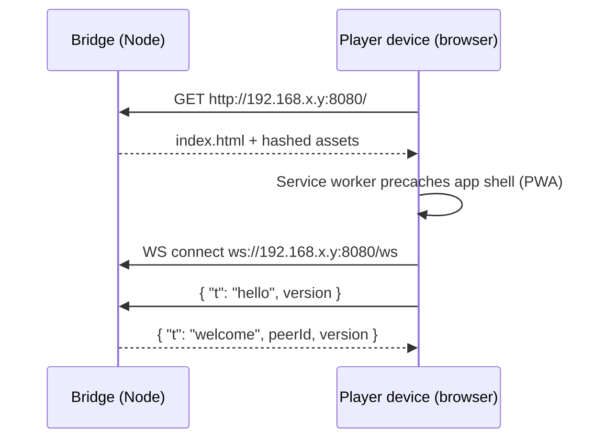
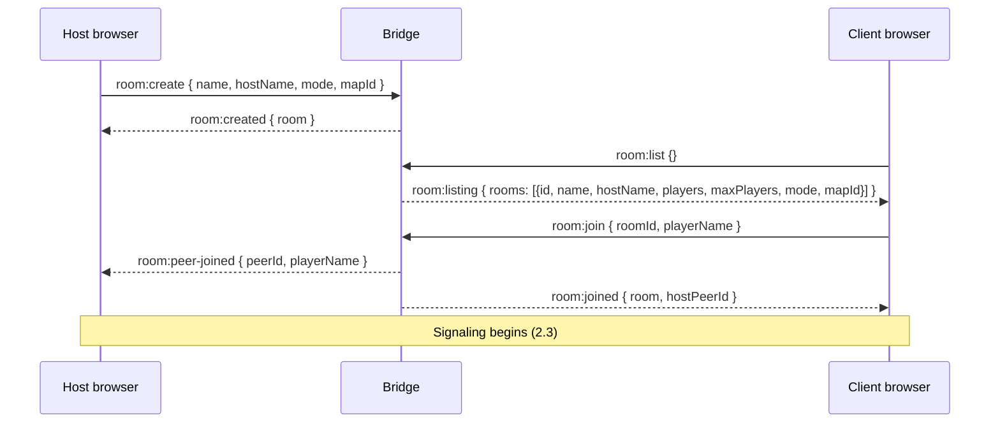
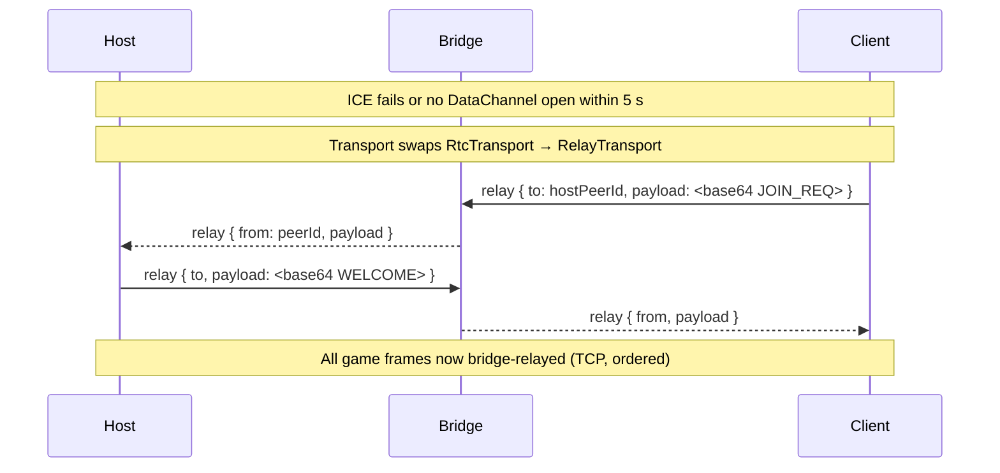

# Aerocade Networking Specification

Aerocade is playable on a LAN with zero internet, zero cloud, and zero accounts. One device runs the
**LAN bridge** (a deliberately game-logic-free Node 20 process) that serves the PWA and provides room
discovery, WebRTC signaling, and a WebSocket relay fallback. The **host player's browser** runs the
authoritative simulation in a star topology of up to 8 players; clients predict their own player and
interpolate everyone else. This document specifies the transport decisions, message catalogs, timing
model, prediction/reconciliation, lag compensation, connection lifecycle, bandwidth budget, and failure
modes. It is the networking counterpart of [architecture.md](architecture.md) and implements
ADR-006 in [DECISIONS.md](DECISIONS.md).

## 1. Browser LAN constraints — evaluation

Browsers cannot open listening sockets, cannot UDP-broadcast, and cannot issue mDNS queries (mDNS in
WebRTC is address _obfuscation_, not discovery). Pure browser-to-browser LAN discovery is therefore
impossible; a rendezvous point must exist.

| Option                    | Verdict                  | Why                                                                                                                                                                                             |
| ------------------------- | ------------------------ | ----------------------------------------------------------------------------------------------------------------------------------------------------------------------------------------------- |
| UDP broadcast / multicast | Rejected                 | No browser API exposes raw UDP. Dead on arrival.                                                                                                                                                |
| mDNS discovery            | Rejected                 | Browsers _emit_ mDNS candidates to hide local IPs; no JS API to _query_ mDNS. Cannot find peers.                                                                                                |
| WebTransport (HTTP/3)     | Rejected (revisit later) | Needs HTTP/3 + a certificate the browser trusts — hostile on a LAN with self-signed certs; weak Safari support. Tracked in [roadmap.md](roadmap.md).                                            |
| WebSocket only            | Fallback                 | Works everywhere, plain `http://` origin, but TCP head-of-line blocking delays fresh state behind retransmits. Acceptable at LAN RTT (<5 ms), not preferred.                                    |
| WebRTC DataChannels       | **Chosen**               | Only browser API with unreliable+unordered delivery (SCTP over DTLS/UDP). Needs signaling — which the bridge provides anyway. No STUN/TURN required on a LAN: host candidates connect directly. |

Conclusion: **bridge for rendezvous, WebRTC for game traffic, WebSocket relay as automatic fallback.**

## 2. Architecture

- **LAN bridge** (`packages/server`): serves the built PWA at `http://<lan-ip>:8080` and a WebSocket
  endpoint at `/ws`. It knows rooms and peer ids — never game state.
- **Host browser**: owns the `SimWorld` (see [ecs.md](ecs.md)), validates inputs, runs all systems at
  60 Hz, emits snapshots at 30 Hz.
- **Client browsers**: send inputs at 60 Hz, predict the local player, interpolate remotes.
- **`Transport` interface** (`packages/shared/protocol`): `sendUnreliable(bytes)`, `sendReliable(bytes)`,
  `onMessage`, `onStateChange`. Two implementations — `RtcTransport`, `RelayTransport` — so game code
  never knows which one is active.

### 2.1 Serving the PWA



### 2.2 Room create / list / join



### 2.3 WebRTC offer/answer/ICE via the bridge

```mermaid
sequenceDiagram
    participant H as Host
    participant B as Bridge
    participant C as Client
    H->>H: new RTCPeerConnection, create 2 DataChannels
    H->>B: signal { to: peerId, data: offer }
    B-->>C: signal { from: hostPeerId, data: offer }
    C->>B: signal { to: hostPeerId, data: answer }
    B-->>H: signal { from: peerId, data: answer }
    par trickle ICE (both directions)
        H->>B: signal { to, data: candidate }
        B-->>C: signal { from, data: candidate }
        C->>B: signal { to, data: candidate }
        B-->>H: signal { from, data: candidate }
    end
    Note over H,C: LAN host candidates pair; DTLS/SCTP up
    C->>H: JOIN_REQ (reliable channel)
    H-->>C: WELCOME (reliable channel)
```

### 2.4 Fallback to WebSocket relay



Fallback triggers: ICE `failed`, DataChannel not `open` within 5 s, or DataChannel closing mid-match
with reconnection failing once. Locked-down APs with client isolation may allow client↔bridge traffic
while blocking client↔client — the relay path survives exactly that case.

## 3. Two-channel design

| Channel | RTC config                                                  | Carries                                                                        | Rationale                                                                        |
| ------- | ----------------------------------------------------------- | ------------------------------------------------------------------------------ | -------------------------------------------------------------------------------- |
| `data`  | unreliable, unordered (`ordered:false`, `maxRetransmits:0`) | `C2H_INPUT` (60 Hz), `H2C_SNAPSHOT` (30 Hz)                                    | Stale inputs/snapshots are worthless; never retransmit, never block behind loss. |
| `ctrl`  | reliable, ordered (defaults)                                | `JOIN_REQ`, `WELCOME`, `H2C_EVENT` (kills, spawns, pickups, match state, chat) | Must-arrive, order-sensitive, low rate.                                          |

On the relay fallback both logical channels share the one WebSocket; a 1-byte channel tag preserves
the semantics (relayed "unreliable" frames are simply allowed to be dropped by the sender when the WS
buffer backs up, capping bufferedAmount-induced latency).

## 4. Bridge message catalog (JSON over WS `/ws`)

All bridge messages are JSON tagged by a `t` field: `{ "t": string, ... }` (types in
`packages/shared/src/protocol/messages.ts`). The bridge routes and forgets; it never inspects game
payloads.

Rooms are described everywhere by one shape, `RoomInfo`:
`{ id, name, hostName, players, maxPlayers, mode, mapId }`.

**Client → bridge:**

| `t`           | Fields                                                                                      | Purpose                                                                 |
| ------------- | ------------------------------------------------------------------------------------------- | ----------------------------------------------------------------------- |
| `hello`       | `version`                                                                                   | Handshake on WS open; must arrive within 10 s or the socket is dropped. |
| `room:create` | `name`, `hostName`, `mode`, `mapId`                                                         | Host registers a room.                                                  |
| `room:list`   | —                                                                                           | Discovery. Clients poll every 2 s in the lobby.                         |
| `room:join`   | `roomId`, `playerName`                                                                      | Join a room; re-joining your own room is idempotent.                    |
| `room:leave`  | —                                                                                           | Leave the current room.                                                 |
| `signal`      | `to` (peerId), `data`                                                                       | Opaque WebRTC signaling relay (SDP or ICE candidate in `data`).         |
| `relay`       | `to`, `payload` (base64 game frame, ≤16 384 chars — oversized is rejected, never truncated) | Game-frame relay when RTC is unavailable.                               |
| `ping`        | —                                                                                           | Application-level keepalive; bridge answers `pong`.                     |

**Bridge → client:**

| `t`                | Fields                            | Purpose                                                                                                                    |
| ------------------ | --------------------------------- | -------------------------------------------------------------------------------------------------------------------------- |
| `welcome`          | `peerId`, `version`               | Reply to `hello`; assigns the session's peer id.                                                                           |
| `room:created`     | `room` (`RoomInfo`)               | Reply to `room:create`.                                                                                                    |
| `room:listing`     | `rooms` (`RoomInfo[]`)            | Reply to `room:list`.                                                                                                      |
| `room:joined`      | `room` (`RoomInfo`), `hostPeerId` | Reply to `room:join`; joiner learns whom to signal.                                                                        |
| `room:peer-joined` | `peerId`, `playerName`            | Sent to room members when a peer joins.                                                                                    |
| `room:peer-left`   | `peerId`                          | Sent to room members when a peer leaves or times out.                                                                      |
| `room:closed`      | `roomId`                          | Room torn down (host gone).                                                                                                |
| `signal`           | `from` (peerId), `data`           | Forwarded signaling.                                                                                                       |
| `relay`            | `from`, `payload`                 | Forwarded game frame.                                                                                                      |
| `error`            | `code`, `message`                 | Failure reporting. Codes: `bad-message`, `version-mismatch`, `room-not-found`, `room-full`, `not-in-room`, `rate-limited`. |
| `pong`             | —                                 | Reply to `ping`.                                                                                                           |

Bridge hardening (implemented; details in [security.md](security.md)): WS `maxPayload` of 128 KiB and
a 32 KiB cap on any JSON message; per-connection rate limit of 240 msg/s; at most 64 concurrent peers;
a 30 s WS ping heartbeat where 2 missed pongs terminate the socket (triggering room cleanup); a 10 s
`hello` timeout; and malformed messages are rejected with `bad-message` rather than parsed leniently.

If no bridge is reachable, discovery degrades to manual `ip:port` entry or a QR code shown by the
host — the documented trade-off from ADR-006. See [ui.md](ui.md) for the lobby flows and
[security.md](security.md) for bridge input validation and rate limits.

## 5. Game message catalog (binary, little-endian, over `Transport`)

Codec lives in `packages/shared/protocol`; every message starts with a `u8` message id. Positions are
quantized to 1/256 m (map is 48×27 m — fits `u16` with headroom), velocities to 1/256 m/s in `i16`.

### 5.1 `C2H_INPUT` — client → host, unreliable, 60 Hz

Each datagram carries the newest input frame plus the two previous frames (redundancy), so one lost
packet costs nothing and two lost packets cost one frame.

| Field        | Type   | Notes                                                                                                  |
| ------------ | ------ | ------------------------------------------------------------------------------------------------------ |
| msgId        | u8     | `0x01`                                                                                                 |
| seq          | u16    | Input sequence number, wraps; monotonically increments per sim tick.                                   |
| clientTick   | u32    | Client's predicted tick for the newest frame.                                                          |
| ackTick      | u32    | Newest snapshot tick the client has decoded — the host's delta baseline ack.                           |
| buttons      | u16    | Bitfield: 0 jetpack/jump, 1 fire, 2 melee, 3 grenade, 4 reload, 5 weaponSwitch, 6 walk, 7–15 reserved. |
| moveX, moveY | i8 ×2  | Move axes, −127..127 → −1..1 (analog for twin-stick/gamepad; ±127 for keys).                           |
| aim          | u16    | Aim angle, 0..65535 → 0..2π (~0.0055° resolution — sniper-safe).                                       |
| prev[2]      | 6 B ×2 | Two previous frames: `buttons u16, moveX i8, moveY i8, aim u16` (seq implied: seq−1, seq−2).           |

Total: 29 bytes. The host applies each input exactly once (dedup by seq), on the tick it services;
inputs arriving early are queued, inputs older than the last applied seq are dropped.

### 5.2 `H2C_SNAPSHOT` — host → client, unreliable, 30 Hz, delta-encoded

| Field              | Type      | Notes                                                                                                                                                                                                                                               |
| ------------------ | --------- | --------------------------------------------------------------------------------------------------------------------------------------------------------------------------------------------------------------------------------------------------- |
| msgId              | u8        | `0x02`                                                                                                                                                                                                                                              |
| tick               | u32       | Host sim tick of this snapshot.                                                                                                                                                                                                                     |
| baselineTick       | u32       | Tick this delta is encoded against; `0xFFFFFFFF` = full keyframe.                                                                                                                                                                                   |
| lastAckedInputSeq  | u16       | Newest input seq from _this_ client applied by the host — drives reconciliation.                                                                                                                                                                    |
| playerMask         | u8        | Bit per player slot: present in this delta.                                                                                                                                                                                                         |
| player records     | 16 B each | `id u8, flags u8, x u16, y u16, vx i16, vy i16, aim u16, health u8, fuel u8, weapon u8, ammo u8`. `flags`: alive, onGround, jetpack, hover, spawnProt, firing, facing, reloading. Delta: only slots whose record changed vs. baseline are included. |
| projCount          | u8        | Active projectile records following.                                                                                                                                                                                                                |
| projectile records | 11 B each | `id u16 (pool index + generation), type u8, x u16, y u16, vx i16, vy i16`.                                                                                                                                                                          |
| pickupDirtyCount   | u8        | Changed pickups only.                                                                                                                                                                                                                               |
| pickup records     | 2 B each  | `index u8, state u8`.                                                                                                                                                                                                                               |

Delta encoding: the host keeps a 32-entry ring of encoded snapshots per client and diffs against the
client's `ackTick`. If the ack is older than the ring (or absent for >1 s), it sends a keyframe.
Worst-case keyframe ≈ 1.6 kB (8 players + ~100 projectiles); typical delta ≈ 200–400 B.

### 5.3 `H2C_EVENT` — host → client, reliable

`msgId u8 (0x03), eventType u8, tick u32, payload`. Event types: `PLAYER_JOINED`, `PLAYER_LEFT`,
`SPAWN`, `DEATH (killerId u8, victimId u8, weaponId u8, flags u8)`, `PICKUP_TAKEN`,
`MATCH_STATE (phase u8, timeLeft u16)`, `CHAT (len-prefixed UTF-8, ≤120 B)`.

### 5.4 `JOIN_REQ` / `WELCOME` — reliable, once per connection

| Message             | Fields                                                                                                                                                  |
| ------------------- | ------------------------------------------------------------------------------------------------------------------------------------------------------- |
| `JOIN_REQ` (`0x10`) | `protocolVersion u16, rejoinToken u64 (0 = fresh join), nameLen u8, name UTF-8 ≤16 chars`.                                                              |
| `WELCOME` (`0x11`)  | `playerId u8, hostTick u32, rngSeed u32, mapId u8, mode u8, tuningHash u32, rejoinToken u64, rosterCount u8, roster entries (id u8, nameLen u8, name)`. |

`tuningHash` is a hash of `sim/tuning.ts` + weapon defs + protocol version; mismatch → host rejects
with an `error`-flagged event and the client shows "version mismatch — reload from the bridge".

## 6. Tick and timing model

- Sim: fixed 60 Hz (`SIM_DT = 1/60`), accumulator loop (ADR-004). No variable-dt anywhere.
- Client sends `C2H_INPUT` once per sim tick (60 Hz). Host sends `H2C_SNAPSHOT` every 2nd tick (30 Hz).
- `WELCOME.hostTick` seeds the client clock: `predictedTick = hostTick + ceil(RTT/2 / SIM_DT) + 2`
  (2-tick jitter margin), so inputs arrive just before the host needs them.
- Drift correction: the host stamps each snapshot with how early/late the client's inputs arrive
  (sign of the input queue depth folded into `flags`); the client nudges its accumulator ±0.1 ms per
  tick to stay in the 1–3 tick early band. No step changes mid-match.

## 7. Client prediction and reconciliation

Per sim tick on the client:

1. Sample local input → assign `seq` → store `{seq, input}` in a 128-entry pending ring.
2. Run the _full deterministic sim_ (shared systems from `packages/shared`) on the local world for the
   local player; send `C2H_INPUT`.

Per snapshot received:

1. Decode against baseline `baselineTick`; reject if baseline missing (request keyframe implicitly by
   not advancing `ackTick`).
2. Push remote entity states into the interpolation buffer (§8).
3. Reconcile local player: take the host's state for our player at `lastAckedInputSeq`. Compare to the
   recorded predicted state for that same seq. If position error ≤ 1 cm and velocity error ≤ 5 cm/s,
   accept and drop pending inputs `≤ lastAckedInputSeq`.
4. Otherwise **rewind and replay**: overwrite local player state (position, velocity, fuel, health,
   ammo, timers) with the host's; re-run input → movement → physics → weapons for the local player for
   every pending input with `seq > lastAckedInputSeq`. This yields a corrected "now".
5. Render smoothing: the visual error between old and corrected predicted positions is stored as a
   render-only offset that decays to zero over ~100 ms — corrections never snap the camera.

Determinism rules (ADR-009) make step 4 exact for self-replay; cross-machine float drift is corrected
by the very same loop, which is why bit-identical trig across engines is not required.

## 8. Interpolation buffer and extrapolation

- Remote entities render at `renderTime = newestSnapshotTime − 100 ms` (~3 snapshot intervals of
  cushion). Positions/aim lerp between the two bracketing snapshots.
- Buffer starvation: if no bracketing pair exists, extrapolate from the last known state using its
  velocity, **capped at 120 ms**. Beyond the cap the entity freezes and fades 20% (visibly stale)
  rather than sliding through walls.
- Adaptive delay: if starvation occurs >3 times in 5 s, the delay grows in 16.7 ms steps up to 150 ms;
  it shrinks back after 10 clean seconds. Local player is never interpolated — it is predicted (§7).

## 9. Lag compensation — rewind ring

The host keeps a 64-tick ring (~1.07 s) of per-player positions and AABBs (0.85 m × 1.65 m), written
after the physics system each tick — cheap by construction, since state is struct-of-arrays and a
history entry is a few `TypedArray.set()` calls (ADR-003).

On a hitscan shot from client _c_ at host tick _T_:

1. `rewindTicks = round((RTT_c/2 + 100 ms) / SIM_DT)`, clamped to [0, 63] — the client's view lags by
   half the RTT plus its interpolation delay.
2. Rewind all _other_ players' AABBs to tick `T − rewindTicks`; raycast against the rewound hitboxes
   and the static tile grid (never rewound).
3. Apply damage in the present. Movement, projectiles, and explosions are **not** rewound — rockets
   and grenades are dodgeable by design; only instant-hit weapons (Rivet Pistol, Vortex SMG, Pulse
   Rifle, Scattergun, Longbolt Rifle) use the ring.

Favor-the-shooter is bounded: at LAN RTTs the rewind is typically 6–8 ticks, imperceptible to victims.

## 10. Connection lifecycle

States: `DISCOVERING → SIGNALING → CONNECTING → JOINING → SYNCED → PLAYING → (LOST → REJOINING)`.

- **Join**: WS hello → room:join → RTC signaling (or relay fallback) → `JOIN_REQ`/`WELCOME` → first
  keyframe snapshot → client spawns with 2.5 s spawn protection.
- **Leave (graceful)**: client closes channels; host emits `PLAYER_LEFT`, frees the slot.
- **Loss detection**: no `data`-channel traffic for 2 s → `LOST`; transport attempts RTC restart once,
  then relay fallback, then full re-signaling via the bridge.
- **Rejoin/recovery**: the host parks a disconnected player's entity (frozen, non-targetable) for a
  15 s grace window keyed by `rejoinToken`. A `JOIN_REQ` with a matching token restores the same
  `playerId`, score, and loadout, and answers with a keyframe. After 15 s the slot is freed and a
  rejoin becomes a fresh join.
- **Host departure**: the match ends for everyone (`MATCH_STATE: aborted`). Host migration is a
  non-goal for M2–M4; see [roadmap.md](roadmap.md).

## 11. Bandwidth budget (8 players, per-link)

Overhead assumptions: DataChannel frame ≈ +50 B (IP/UDP/DTLS/SCTP); relay WS frame ≈ +40 B (IP/TCP/WS).

| Flow                                          | Payload | Rate        | Payload B/s | On-wire ≈            |
| --------------------------------------------- | ------- | ----------- | ----------- | -------------------- |
| Client → host inputs                          | 29 B    | 60 Hz       | 1.7 kB/s    | ~4.7 kB/s            |
| Host → client snapshots (typical delta)       | ~300 B  | 30 Hz       | 9.0 kB/s    | ~10.5 kB/s           |
| Host → client snapshots (keyframe worst case) | ~1.6 kB | 30 Hz burst | 48 kB/s     | ~50 kB/s (transient) |
| Reliable events + chat                        | —       | sporadic    | <0.5 kB/s   | <1 kB/s              |

Host aggregate at 7 remote clients: receive ≈ 33 kB/s, send ≈ 80 kB/s (~0.65 Mbps) — comfortably
inside any Wi-Fi budget; the real ceiling is host CPU, tracked in [performance.md](performance.md).
Relay mode routes both directions through the bridge: ~0.7 Mbps down + up on the bridge's NIC, still
trivial.

## 12. Failure modes and degradation

| Failure                              | Detection                 | Degradation / recovery                                                                                                                                                                          |
| ------------------------------------ | ------------------------- | ----------------------------------------------------------------------------------------------------------------------------------------------------------------------------------------------- |
| Bridge process dies mid-match        | WS close                  | RTC matches continue untouched (bridge is rendezvous-only). No new joins, no rejoins needing signaling. Relay-connected clients drop and see "bridge lost".                                     |
| WebRTC blocked (AP client isolation) | ICE failed / 5 s timeout  | Automatic WS relay via bridge (§2.4). Ordered TCP adds head-of-line risk, tolerable at LAN RTT.                                                                                                 |
| Packet loss (unreliable channel)     | seq gaps / snapshot gaps  | Inputs: 3-frame redundancy absorbs single losses. Snapshots: interpolation cushion, then ≤120 ms extrapolation, then freeze+fade. Delta baselines are ack-driven, so loss never corrupts state. |
| RTT spike / Wi-Fi jitter             | drift feedback (§6)       | Client clock nudges forward; interpolation delay adapts up to 150 ms; reconciliation absorbs mispredictions.                                                                                    |
| Client ack starvation (>1 s)         | host-side ack age         | Host downgrades that client to keyframes until acks resume.                                                                                                                                     |
| Host tab throttled (backgrounded)    | snapshot cadence stalls   | All clients see uniform stall; UI warns the host to keep the tab foregrounded. Mitigations in [performance.md](performance.md).                                                                 |
| Client crash / tab close             | 2 s silence               | Entity parked 15 s for token rejoin (§10), then removed.                                                                                                                                        |
| Version/tuning mismatch              | `tuningHash` in `WELCOME` | Join refused with explicit reason; client reloads the PWA from the bridge to update.                                                                                                            |
| Malformed/hostile input              | host + bridge validation  | Host clamps axes, rate-limits fire by weapon cycle, ignores bad seqs; bridge rate-limits and rejects with `error`. Details in [security.md](security.md).                                       |

## 13. Testing hooks

Playwright e2e (from M2, per ADR-010) boots the bridge plus two browser contexts, hosts and joins,
then asserts state convergence; protocol codecs get Vitest round-trip tests, and reconciliation is
unit-tested by replaying scripted input streams against a scripted snapshot stream — all headless via
`packages/shared`. See [testing.md](testing.md).
