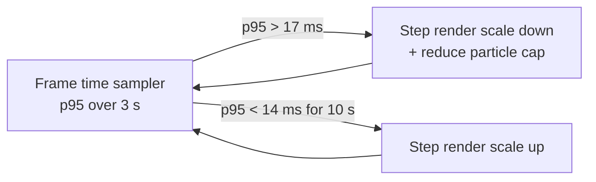

# Performance

Aerocade targets a locked 60 FPS on mid-range Android hardware (2019+, e.g. 4-core mid-tier SoC,
Mali/Adreno-class GPU) while running the full deterministic simulation, client prediction, and a
Phaser render pass in a single browser main thread. This document defines the frame budget, the
zero-allocation rules that keep the garbage collector out of gameplay, the network encoding
budgets, renderer cost controls, the profiling workflow, memory targets, startup goals, the
headless benchmark that gates regressions, and the ranked list of known risk areas. It assumes
the architecture in [DECISIONS.md](DECISIONS.md) (ADR-003, ADR-004, ADR-005) and complements
[architecture.md](architecture.md), [rendering.md](rendering.md), [networking.md](networking.md),
and [testing.md](testing.md).

## Frame budget

One display frame at 60 Hz is 16.6 ms. The sim runs at a fixed 60 Hz (`SIM_DT = 1/60`) inside an
accumulator, so a typical frame executes exactly one sim tick; after a stall the accumulator may
run two or three. Budgets are set so that the *typical* frame leaves ≥ 4 ms of slack for the
browser (compositing, input, incremental GC) and the *worst* frame (2 catch-up ticks + snapshot
decode + reconciliation replay) still fits under 16.6 ms.

| Stage | Typical budget | Worst-case budget | Notes |
|---|---:|---:|---|
| Sim tick(s) (all systems, ADR-005 order) | 2.5 ms | 5.0 ms | 1 tick typical; 2 catch-up ticks worst case |
| Reconciliation replay (client, M2+) | 0.5 ms | 2.0 ms | Replays ≤ RTT×60 predicted ticks after a snapshot; hard cap 12 ticks |
| Net encode/decode (input send, snapshot apply) | 0.5 ms | 1.0 ms | Typed-array codec, no JSON on the game channel |
| Interpolation + render-state prep | 0.5 ms | 0.5 ms | Lerp between sim states / snapshot buffer |
| Phaser update + draw | 6.0 ms | 6.0 ms | Sprite sync, particles, camera, single-atlas batch |
| React/HUD DOM | 0.3 ms | 0.5 ms | Imperative updates only; no per-frame setState |
| Slack (browser, GC headroom) | 6.3 ms | 1.6 ms | |

Rules derived from the table:

- A single sim tick must cost **≤ 2.5 ms on mid-range Android** at full load (8 players, 256 live
  projectiles). The headless benchmark below enforces a proxy for this on CI.
- If the accumulator falls more than **5 ticks** behind, we drop the excess and re-anchor
  (spiral-of-death guard) rather than simulate a burst that blows several frames.
- Renderer over-budget triggers the dynamic resolution governor (see below) before anything else
  is sacrificed; sim correctness is never degraded.

## Zero-allocation gameplay

Per ADR-004/005, all match state lives in preallocated struct-of-arrays pools. **No allocation is
permitted in any sim system or in the render hot path during a match.** Allocation is confined to
boot, map load, and match setup/teardown.

Pool inventory (all fixed-capacity, allocated once at `SimWorld` creation):

| Pool | Capacity | Backing | Approx. footprint |
|---|---:|---|---:|
| Players | 8 | Parallel typed arrays (pos, vel, health, fuel, aim, ammo, timers, flags) | ~4 KB |
| Projectiles | 256 | Parallel typed arrays (pos, vel, type, owner, ttl/fuse, flags) | ~24 KB |
| Pickups | 64 | Parallel typed arrays (pos, type, respawn timer, flags) | ~2 KB |
| Snapshot buffers | 3 (interp/net) | Typed-array copies of the above | ~90 KB |
| Rewind ring (host, M3 lag comp) | 64 ticks | Typed-array copies | ~2 MB ceiling |
| Render sprite pool | ≥ pool caps | Phaser sprites, pre-created, visibility-toggled | GPU/JS mixed |
| Particle emitters | fixed set | Pre-created Phaser emitters, hard particle caps | GPU/JS mixed |
| Scratch vectors/AABBs | ~a dozen | Module-level reusable temps in `shared` math | negligible |

Entity "creation" is flag-flipping (`alive[i] = 1`) plus field writes at a free index; "deletion"
clears the flag. Snapshots are `TypedArray.set()` copies — no object graphs, no serialization
allocations.

## GC-spike avoidance in JS

The GC is the main threat to frame pacing on Android Chrome. Tactics, enforced in review and by
lint rules where possible:

- **Reused scratch temporaries.** Vector/AABB math writes into caller-provided or module-level
  scratch objects; no function in `packages/shared` returns a fresh object per call on a hot path.
- **Typed arrays everywhere** for state, snapshots, and the wire codec (`DataView` over a
  preallocated `ArrayBuffer` per channel; buffers are reused, never re-created per message).
- **No closures in hot loops.** Systems are top-level functions; per-entity callbacks
  (`forEach`, inline arrow predicates) are banned inside systems — plain indexed `for` loops only,
  iterating ascending entity index (which ADR-009 requires anyway).
- **No array spread/`map`/`filter`/`slice`/destructuring** in systems or the render sync loop —
  each allocates. String building (kill feed text, etc.) happens in UI code at event rate, not in
  the sim.
- **Stable object shapes.** `SimWorld` and message structs are fully initialized at construction
  and never gain/lose keys, keeping V8 in fast hidden-class paths.
- **Event data via ring buffers.** Sim → renderer events (shots, hits, deaths) are written into a
  preallocated event ring of numeric records, not per-event objects.
- **Verification:** the Chrome Allocation Timeline must show a flat sawtooth-free line during a
  60-second match sample; any allocation traced to `shared` sim code is a bug.

## Network encoding costs and the 30 Hz snapshot budget

Game traffic uses the binary codec from [networking.md](networking.md); JSON appears only on the
bridge WebSocket control plane (ADR-006). Budgets:

| Payload | Rate | Size budget | Bandwidth (worst) |
|---|---|---:|---:|
| Client → host input packet | 60 Hz | ≤ 24 B (seq, buttons bitfield, aim, redundant last 3 inputs) | ~12 kbit/s per client |
| Host → client delta snapshot | 30 Hz | ≤ 1.2 KB typical, ≤ 6 KB full/keyframe | ≤ 290 kbit/s per client typical |
| Reliable events (join/spawn/match) | sporadic | ≤ 512 B | negligible |

- A **full snapshot** (8 players + 256 projectiles + 64 pickups) is ~6 KB. Deltas encode only
  entities whose fields changed since the client's last acked tick; with 8 players and a few dozen
  live projectiles, typical deltas land at 300–900 B. Keyframes go out on join and every 60 ticks
  as a delta-loss backstop.
- Encoding/decoding must stay under the 0.5 ms typical budget: a single pass over pools writing
  into a reused `ArrayBuffer`, quantizing positions to 1/256 m (u16 per axis on a 48×27 m map)
  and velocities/aim to i8/i16.
- **One message per tick per direction.** Never emit multiple small DataChannel messages per tick;
  per-message overhead (SCTP + JS event dispatch) dominates payload at small sizes.
- The host encodes 7 client snapshots per net tick; total host upstream stays ≤ ~2 Mbit/s worst
  case — trivial for LAN Wi-Fi, but the *CPU* cost of encoding on a phone host is what the 30 Hz
  rate (not 60) protects.

## Phaser-side costs

Phaser renders only (ADR-003); its update loop must not become the budget's biggest line item.
Details in [rendering.md](rendering.md); the performance-relevant rules:

- **Single generated texture atlas.** All sprites (players, weapons, projectiles, pickups, tiles,
  particles) are procedurally drawn into one runtime-generated atlas at boot, so the entire scene
  batches into a minimal number of draw calls. Target: **≤ 12 draw calls** in gameplay.
- **Pooled sprites and particles.** Sprite objects are pre-created to pool capacities and toggled
  with `setVisible`/`setActive`; nothing is instantiated or destroyed mid-match. Particle
  emitters are pre-created with hard `maxParticles` caps.
- **Camera culling.** Off-screen sprites are skipped via camera-bounds checks in the sync loop
  (cheap AABB vs. view rect) before touching Phaser objects; the tilemap layer uses Phaser's
  built-in cull.
- **Static geometry is static.** The Foundry tile layer renders from a cached layer, not
  per-tile sprites; it is drawn once per frame as a batched quad set with no per-frame iteration.
- No Phaser physics, no `Graphics` primitives in the frame loop (debug overlays excepted, dev
  builds only), no per-frame text object churn — HUD text lives in React/DOM.

## DPR capping and resolution scaling

Full-DPR rendering is the top GPU cost on phones (a 1080p screen at DPR 2.6+ is > 2× the pixels
of the panel). Policy:

- **Cap DPR at 2.0** globally; cap at **1.5** when the quality tier is Low.
- **Dynamic resolution governor:** the canvas backing-store resolution scales independently of
  CSS size. If p95 frame time exceeds 17 ms over a 3-second window, step render scale down
  (1.0 → 0.85 → 0.72 → 0.6); if p95 stays under 14 ms for 10 s, step back up. Scale changes are
  applied between frames and never mid-frame.
- Quality tiers (Low/Medium/High) also scale particle counts and disable additive glow layers;
  the tier is auto-picked on first run from a 2-second render micro-bench, user-overridable in
  settings ([ui.md](ui.md)).

## Profiling workflow

1. **Instrumentation is always on** (cost ≈ 0): `performance.mark`/`performance.measure` wraps
   each sim tick (`sim:tick`), snapshot encode/decode (`net:encode`, `net:decode`), reconciliation
   replay (`net:replay`), and the render sync (`render:sync`). Marks feed both the overlay and
   Chrome traces.
2. **On-screen perf overlay** (dev builds and a hidden settings toggle): FPS, frame-time graph,
   per-stage ms from the marks above, live pool occupancy, draw calls, heap size, current render
   scale. It renders into a DOM layer, not the game canvas, so it cannot distort GPU measurements.
3. **Chrome DevTools Performance panel / `chrome://tracing`** on desktop for flame charts; the
   `performance.measure` spans appear in the Timings track, making sim vs. render vs. GC
   attribution immediate.
4. **Android remote debugging:** `chrome://inspect` over USB against the device browser pointed at
   the bridge URL. All 60 FPS sign-offs happen on the reference mid-range device, never on
   desktop.
5. **Regression captures:** before each milestone exit (M1, M2, M6 hardening — see
   [roadmap.md](roadmap.md)), record a 60 s trace of an 8-bot Foundry match and archive the
   per-stage p50/p95 numbers in the milestone notes.

## Memory targets and leak checks

| Metric | Target |
|---|---|
| Total JS heap during a match (mid-range Android) | < 128 MB |
| `shared` sim state (pools + snapshots + rewind ring) | < 3 MB, fixed at match start |
| Heap growth across 10 consecutive matches (return to menu between) | ±5% (flat) |
| Detached DOM nodes after leaving a match | 0 |

- **Pool high-water marks:** every pool tracks its peak live count per match and logs it at match
  end. A projectile high-water mark pinned at capacity (256) or a count that never returns to 0
  post-match indicates an `alive`-flag leak — this is asserted in soak tests (M8).
- **Cross-match leak check:** the Playwright soak scenario ([testing.md](testing.md)) plays N
  short matches and compares `performance.memory` (and a DevTools heap snapshot when run
  manually) between match 2 and match N; growth beyond the target fails the run.
- Listener hygiene: every `addEventListener`/Phaser event/React effect registered on match start
  must be removed on match end; the leak check above is the enforcement backstop.

## Startup performance

- **Precache:** Workbox precaches the full app shell (ADR-007); warm start from the service
  worker must reach the menu in **< 1.5 s** on the reference device, first LAN load in **< 3 s**.
- **Code splitting:** the menu bundle (React, settings, lobby) loads first; Phaser and the game
  scene live in a separate chunk, dynamically imported — prefetched on menu idle, awaited on
  match start. Phaser never blocks first paint.
- **Lazy audio:** generated audio buffers are synthesized on the first user gesture (which
  autoplay policy requires anyway), off the critical path, and cached for the session.
- **Atlas generation** (procedural art) runs once behind the loading screen with a visible
  progress state; target < 400 ms.

## Headless ticks/sec benchmark (regression gate)

Because `packages/shared` has zero DOM dependencies (ADR-002), the full sim benchmarks in Node:
`npm run bench:sim` constructs a Foundry match with 8 scripted bots, forces sustained worst-case
load (bots firing Vortex SMGs and Thumpers to keep the projectile pool hot), runs 10,000 ticks,
and reports ticks/sec plus bytes allocated (via `--expose-gc` heap sampling, which must be ~0).

- **Gate:** CI fails if ticks/sec drops **> 15% below the committed baseline** for the runner, or
  if per-tick heap allocation is non-zero. The baseline file is updated deliberately, in its own
  commit, with justification.
- Rationale: CI hardware is faster than the target phone, so the absolute number is not the 60 FPS
  proof (device sign-off is), but the *relative* gate catches accidental O(n²) loops, allocation
  regressions, and system-cost creep the moment they land. It runs as part of `npm run verify`
  extensions in CI, per [testing.md](testing.md).

## Known risk areas (ranked)

| # | Risk | Why it bites | Mitigation |
|---|---|---|---|
| 1 | **Particle overdraw on mobile** — explosions (Thumper r=3.2 m, frags) + 8 jetpack flames stack additive-blended quads; tile-based mobile GPUs choke on fill rate, not vertex count | Worst case: multi-rocket fight in a corridor → full-screen overlapping additive layers | Hard global particle cap per tier; explosion emitters share one budget (oldest culled); additive glow disabled on Low; DPR/resolution governor recovers automatically; overlay shows live particle count |
| 2 | **RTC message rate / per-message overhead** — 8 peers × 60 Hz inputs + 30 Hz snapshots on a phone *host*; SCTP + JS event dispatch per message costs more than the bytes | Host frame budget erodes; input jitter appears as gameplay stutter for everyone | One message per tick per peer, batched fields; redundant-input piggybacking instead of retransmit chatter; snapshot rate fixed at 30 Hz (never 60); decode/encode ms tracked in overlay; relay fallback inherits the same budgets |
| 3 | **React re-render leaks into the game loop** — HUD state (health, ammo, fuel) updated via setState at 60 Hz forces reconciliation + layout every frame | Death by a thousand 0.5 ms cuts; worst on low-end phones where style/layout is slow | HUD reads sim state through a subscription store with imperative DOM/text updates for per-frame values; React re-renders only on discrete events (kill feed, scoreboard at ≤ 10 Hz); `React.memo` on HUD tree; overlay flags any frame with > 1 React commit |
| 4 | **Reconciliation replay bursts** — high RTT spike → many predicted ticks replayed in one frame | One-frame hitch on the client after loss | Replay cap (12 ticks) with snap-to-authoritative beyond it; replay ms instrumented |
| 5 | **Rewind-ring memory on phone hosts** — 64 snapshot copies live on the host | Heap pressure on the weakest possible host device | Ring stores quantized player state only (not projectiles/pickups) since lag comp needs hitboxes; ceiling stays ≪ 2 MB |

Anything that moves a stage past its budget in the table at the top of this document is treated as
a release blocker for the milestone in flight, not as polish for M6.
