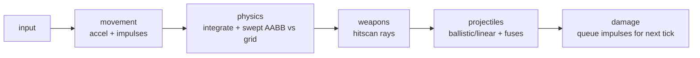

# Aerocade — Physics & Movement Specification

This document specifies the custom physics core in `packages/shared` (`sim/physics/`,
tuning in `sim/tuning.ts`): world representation, integration, collision, the full player
movement model (ground, air, jetpack, hover), impulses, projectile motion, explosions, and
the determinism and testing requirements that make client prediction possible. It is the
implementation contract for the `movement` and `physics` systems described in
[ecs.md](ecs.md) and the rewind/prediction machinery in [networking.md](networking.md).
All decisions here conform to [DECISIONS.md](DECISIONS.md), especially ADR-003, ADR-004,
ADR-008, ADR-009 and ADR-011.

## 1. Why a custom core (ADR-003 summary)

We do not use Matter.js (or any general solver), for three reasons recorded in ADR-003:

1. **Determinism.** Prediction + reconciliation re-simulates ticks from a snapshot and must
   reproduce identical results. General solvers' iteration order and internal caches make
   bit-stable resimulation impractical.
2. **Rewind.** Lag compensation restores state N ticks back. Our state is flat
   struct-of-arrays, so snapshot/restore is a few `TypedArray.set()` calls; serializing a
   solver world is slow and lossy.
3. **Fit.** The game needs AABBs vs. a static tile grid, swept movement, rays, and circle
   overlaps. A constraint solver buys nothing and costs GC pressure and CPU on mid-range
   Android.

Accepted trade-off: we own collision correctness. Mitigation: a small (~500 line) physics
core with the exhaustive unit-test matrix in §10. Phaser physics (Arcade and Matter) is
**disabled**; Phaser only renders (see [rendering.md](rendering.md)).

## 2. World representation

- **Static tile grid.** A map is a `W × H` grid of tiles, 1 tile = 1 m (ADR-008). Foundry
  is 48×27. v1 tile classes: `EMPTY` and `SOLID`. Solid tiles are full unit squares; the
  collision query is `solidAt(tx, ty)` — an O(1) index into a `Uint8Array`.
- **Coordinate convention.** `+x` right, `+y` down. Gravity is positive `y`; a jump sets a
  negative `vy`. Positions are AABB centers in meters (`Float32Array` pools per ADR-005).
- **Dynamic bodies.** Players (AABB 0.85 × 1.65 m) and projectiles (point or small AABB).
  Bodies collide with the grid, never with each other as solids — player↔player is overlap
  only (melee/pickup queries), no push-out in v1.
- **AABB movers (M6).** Moving platforms and jump pads arrive in milestone M6 as
  kinematic AABBs swept before players each tick, carrying riders by their delta. The tile
  broadphase and axis-separated resolver in §4 are written so movers slot in as an extra
  blocker list; nothing in v1 assumes "grid only".
- **Slopes: out of scope for v1.** Only axis-aligned full tiles. Slopes would complicate
  the swept resolver and the grounded probe for little gain on arena maps. If a later map
  needs ramps, that is a new ADR, not a silent extension.

## 3. Integration — semi-implicit Euler at fixed dt

Fixed 60 Hz (`SIM_DT = 1/60`), accumulator loop, render-rate interpolation (ADR-004). No
variable-dt physics anywhere. Per body, per tick:

```
v += a * SIM_DT      // velocity first (semi-implicit / symplectic Euler)
p += v * SIM_DT      // then position, using the *new* velocity
```

Semi-implicit Euler is chosen over explicit Euler (energy gain under gravity) and
Verlet/RK4 (needless complexity, awkward with instantaneous impulses). At a fixed 60 Hz
step it is stable, cheap, and — critically — trivially deterministic to re-run.

Order inside a tick (systems per ADR-005): `movement` converts input intent into
accelerations and instantaneous velocity changes (jump, jetpack, impulses queued by
`damage` last tick); `physics` integrates and resolves collisions for players, then
projectile motion runs in `projectiles`. Iteration is always ascending entity index.



## 4. Collision — swept AABB vs. tile grid, axis-separated

Resolution is **per axis, X first, then Y**, each axis a swept test (never
"move-then-push-out", which jitters and tunnels):

1. **X sweep.** Compute the target `x' = x + vx*dt`. Walk tile columns from the current
   leading edge toward `x'` (direction of motion), testing every tile row the AABB's
   _current_ Y-span overlaps. On the first solid column, clamp the AABB flush to the tile
   face minus a skin of `SKIN = 0.001 m`, set `vx = 0`. Otherwise accept `x'`.
2. **Y sweep.** Same along Y using the _post-X-resolve_ x position. Clamping while moving
   down (`vy > 0`) sets the **grounded** flag and `vy = 0`; clamping while moving up is a
   head bump, `vy = 0`.
3. **Grounded probe.** After resolution, `grounded = (vy >= 0)` AND a solid tile lies
   within `GROUND_PROBE = 0.02 m` below the feet. Walking off a ledge clears it the same
   tick; the `movement` system separately grants a `coyoteTime = 0.08 s` grace during
   which a jump press still fires (§5) — the forgiveness lives in the sim, not the client.

X-before-Y gives stable behavior for a side-view game: running into a wall while falling
slides you down the wall; landing while strafing slides you along the floor. The order is
fixed and identical everywhere — it is part of the determinism contract.

**Tunneling guarantee.** Because the sweep walks _every_ tile boundary between old and new
positions, no per-axis speed can skip a wall. Player speed is additionally hard-capped at
`hardSpeedCap = 45 m/s` (post-impulse clamp, both axes combined) which keeps per-tick
displacement ≤ 0.67 m and sweep spans short. Projectiles use segment tests (§7) and have
no cap requirement.

**Corner rule.** A body whose target position penetrates a corner tile diagonally is
resolved by the X sweep first by construction; the Y sweep then sees the corrected X-span.
There is no diagonal resolution case.

## 5. Player movement model

All constants live in `sim/tuning.ts`; the table is normative.

| Constant         | Value         | Notes                                              |
| ---------------- | ------------- | -------------------------------------------------- |
| Player AABB      | 0.85 × 1.65 m | center-anchored                                    |
| Max health       | 100           | see damage in [ecs.md](ecs.md)                     |
| Run speed        | 7.4 m/s       | target horizontal speed                            |
| Walk speed       | 4.2 m/s       | walk modifier held                                 |
| Ground accel     | 55 m/s²       | toward target speed                                |
| Air accel        | 26 m/s²       | air control                                        |
| Air drag         | 1.6 /s        | damps `vx` every airborne tick                     |
| Ground friction  | 48 m/s²       | decel toward 0, no input                           |
| Jump velocity    | 8.6 m/s       | instantaneous, `vy = −8.6`                         |
| Jump-cut gravity | ×2.2          | extra gravity while rising, jump & thrust released |
| Coyote time      | 0.08 s        | jump grace after leaving a ledge                   |
| Gravity          | 21 m/s²       | +y                                                 |
| Max fall speed   | 26 m/s        | clamp on `vy`                                      |
| Jetpack thrust   | 38 m/s²       | −y while thrusting                                 |
| Fuel capacity    | 100           | full tank ≈ 2.17 s continuous burn                 |
| Burn rate        | 46 fuel/s     | while thrusting (non-hover)                        |
| Regen rate       | 30 fuel/s     | after regen delay                                  |
| Regen delay      | 0.6 s         | after thrust released (36 ticks)                   |
| Hover brake      | 19 m/s²       | `vy` → 0 while hovering (thrust + down)            |
| Hover burn       | 20 fuel/s     | ≈ 5 s hover on full tank                           |
| Speed cap        | 45 m/s        | post-impulse safety clamp                          |
| Respawn delay    | 3 s           | then spawn-point placement                         |
| Spawn protection | 2.5 s         | cleared early on firing                            |

**Ground movement.** With horizontal input, accelerate `vx` toward `±run` (or `±walk`) at
55 m/s², clamped so a single tick never overshoots the target. With no input and grounded,
apply friction: move `vx` toward 0 by `48 * SIM_DT`, clamping at 0 (no sign flip — this is
a rest-stability requirement, §10).

**Air control.** Airborne horizontal input accelerates at 26 m/s² toward the same targets,
but never brakes a faster same-direction velocity — rocket-jump arcs keep their momentum.
A mild air drag of `airDrag = 1.6 /s` damps `vx` every airborne tick
(`vx -= vx * 1.6 * SIM_DT`), so knockback settles instead of persisting forever.

**Jump.** On jump press while grounded — or within the `coyoteTime = 0.08 s` grace after
walking off a ledge — `vy = −8.6` (jumping consumes the grace). **Variable height:** while
still rising (`vy < 0`) with **both** jump and thrust released, gravity is multiplied by
`jumpCutGravityMult = 2.2`; there is no velocity multiply. Tap-jumps stay short; held
jumps reach full height. (Jetpack input is a separate held control — Space doubles as
both: press while grounded jumps, held while airborne thrusts.)

**Gravity & fall clamp.** Every airborne tick: `vy += 21 * SIM_DT`, then
`vy = min(vy, 26)`.

**Jetpack.** While thrust is held and `fuel > 0`: apply −38 m/s² on top of gravity (net
−17 m/s² upward) and burn 46 fuel/s. At `fuel == 0` thrust cuts out (no reserve, no
sputter). Releasing thrust starts the 0.6 s regen delay; after it, fuel regenerates at
30/s to 100. Firing weapons does not affect fuel.

**Hover mode (ADR-011).** Hover is an **explicit input**, not an automatic band: thrust
held **plus the down input** (`cmd.moveY > 0.5` — S on desktop, stick-down on mobile)
while airborne with fuel. The jetpack then cancels that tick's gravity and brakes `vy`
toward 0 at `hoverBrake = 19 m/s²`, holding altitude once settled, and burn drops to
`hoverBurnRate = 20 fuel/s` (vs. 46 climbing). Releasing either input restores normal
climb/fall next tick. ADR-011 records why the earlier `|vy|`-band design was scrapped: an
accelerating climb passes through any speed band, capturing players into a hover just off
the ground.

**Respawn & protection.** Death starts a 3 s timer (`respawn` system). On respawn: full
health, full fuel, velocity zeroed, 2.5 s of spawn protection (no damage taken), cleared
immediately when the protected player fires.

## 6. Knockback and external impulses

Impulses are instantaneous **Δv in m/s added directly to velocity** — all players have
unit mass, there is no mass term anywhere. Sources: explosion splash (§8), Longbolt Rifle
hits, Frag grenades, melee. Weapon-specific magnitudes live in
`sim/combat/weapon-defs.ts`.

- The `damage` system _queues_ impulses; `movement` applies them at the start of the
  **next** tick, before integration. This keeps system order effects deterministic and
  means an impulse can never act on a position that was computed after it.
- After applying impulses, total speed is clamped to `hardSpeedCap = 45 m/s` (§4).
- **Rocket jumps** fall out of the rules, they are not special-cased: fire the Thumper at
  the ground, take self-splash impulse (full strength) and self-splash _damage_ scaled by
  `selfDamageFrac = 0.6`. Survivable cost, big vertical Δv — deliberate movement
  tech per the weapon design intent.
- Knockback interacts with hover: a hit does not cancel it — while thrust + down stay
  held, `hoverBrake` re-settles the disturbed `vy` toward 0 at 19 m/s².

## 7. Projectile motion

Projectiles live in the 256-slot pool, integrate with the same semi-implicit Euler, and
collide via **segment tests** (grid DDA from previous to new position, plus segment-vs-AABB
slab tests against players) — a projectile can never tunnel regardless of speed.

| Kind               | Weapons                                                     | Motion                                | On world hit   | On player hit         |
| ------------------ | ----------------------------------------------------------- | ------------------------------------- | -------------- | --------------------- |
| Linear             | Thumper rocket                                              | 24 m/s, straight, **no gravity**      | detonate       | detonate              |
| Ballistic          | Lobber grenade                                              | 16 m/s launch, full gravity (21 m/s²) | detonate       | detonate              |
| Ballistic + bounce | Frag grenade (equipment)                                    | thrown, full gravity                  | bounce (below) | pass over — fuse only |
| Hitscan            | Rivet Pistol, Vortex SMG, Pulse Rifle, Scattergun, Longbolt | instantaneous ray                     | stop           | damage                |

- **Lobber:** detonates on _first impact_ — world tile or player — or when its 2.0 s fuse
  expires mid-flight, whichever comes first.
- **Frag grenade:** never impact-detonates; always the 2.6 s fuse. On tile contact it
  bounces per axis: normal velocity component reflected and scaled by restitution
  **0.45**, tangential component scaled by `bounceFriction = 0.8`. **Settling:** if the
  reflected axis velocity ends below `SETTLE_SPEED = 0.8 m/s` it is zeroed, and a bounce
  whose impact speed was already below 0.8 m/s is silent — no bounce event is emitted. A
  rested grenade (`vy = 0` with a solid tile directly beneath) stops receiving gravity,
  and residual `vx` below 0.8 m/s is zeroed while rested; it then sits until the fuse.
- **Hitscan:** a ray from muzzle along aim, walked through the grid with DDA and tested
  against every alive player AABB (ascending index); the **nearest** hit wins.
  **Penetration rules: none in v1** — the ray stops at the first solid tile or first
  player, period. Scattergun fires 8 independent pellet rays inside its 11° cone (spread
  angles drawn from the seeded RNG); per-pellet damage falloff beyond 14 m is combat-side
  (see weapon-defs). On the host, hitscan runs against the 64-tick rewind ring for lag
  compensation ([networking.md](networking.md)); the ray math is identical either way.
- Arclight Beam and Emberjet (M3) are specified in their milestone; the beam reuses the
  hitscan ray per tick, the flamethrower uses short-lived ballistic particles from this
  pool.

## 8. Explosions

An explosion is an instantaneous circle query at blast center `c` with radius `r`:

1. For each alive player (ascending index), find `p` = closest point on the player AABB to
   `c`; `d = |p − c|`. Skip if `d ≥ r`.
2. **Occlusion:** cast a grid ray `c → p`; if it crosses a solid tile, the player is fully
   shielded — no damage, no impulse. No partial occlusion in v1.
3. **Falloff:** `f = 1 − d / r` (linear). Damage = `maxSplash · f`. Direct projectile
   contact damage (e.g., Thumper's 40) was already applied by the impact hit and stacks
   with splash.
4. **Impulse:** `Δv = maxImpulse · f` along `normalize(playerCenter − c)`; if the centers
   coincide, straight up (−y). Queued per §6.

| Source         | Max splash dmg | Radius | Max impulse (Δv) |
| -------------- | -------------- | ------ | ---------------- |
| Thumper rocket | 55             | 3.2 m  | 13 m/s           |
| Lobber grenade | 45             | 2.8 m  | 11 m/s           |
| Frag grenade   | 62             | 3.4 m  | 14 m/s           |

Self-hits: full impulse, damage × 0.6 (§6). Explosions do not affect other projectiles or
tiles (no destructible terrain in v1).

## 9. Determinism constraints (ADR-009)

The physics core must be replay-identical for the same seed + input sequence:

- **No `Math.random`** — only the seeded mulberry32 `Rng` owned by `SimWorld` (pellet
  spread, bloom). **No `Date.now`** — time is `tick * SIM_DT`.
- Fixed system order, fixed X-then-Y axis order, ascending-index iteration everywhere.
- Zero allocation during a match: all state in the preallocated pools; snapshot = typed
  array copy, restore = `TypedArray.set()`. Resuming simulation from a restored snapshot
  must produce bit-identical ticks (this is what prediction replay does every frame).
- No dependence on frame rate, wall clock, or platform APIs. The core runs identically in
  the host browser, predicting clients, and Node test runners.
- Cross-engine float divergence (trig/sqrt) is tolerated per ADR-009: the host is the
  single source of truth; we need practical determinism for replaying _our own_ inputs,
  not cross-machine lockstep.

## 10. Unit test matrix

Vitest, headless, in `packages/shared` (see [testing.md](testing.md)). Every row is a
required test; tick counts are exact because dt is fixed.

| Test                    | Setup                                            | Assertion                                                                                                                      |
| ----------------------- | ------------------------------------------------ | ------------------------------------------------------------------------------------------------------------------------------ |
| No tunneling, X         | Player at 39 m/s toward a 1-tile wall            | Stops flush at wall − SKIN, `vx == 0`, never inside                                                                            |
| No tunneling, Y         | `vy` forced to 26 m/s (max fall) onto floor      | Lands flush, grounded, `vy == 0`                                                                                               |
| Projectile segment test | Rocket fired point-blank at wall                 | Detonates at wall face, never beyond                                                                                           |
| Corner clipping         | Diagonal motion into an inside corner            | X resolves first, then Y; final position outside both tiles                                                                    |
| Rest stability          | Grounded, no input, 600 ticks                    | `y` bit-identical every tick, `vx == vy == 0`, no jitter                                                                       |
| Friction stop           | `vx = 7.4`, release input on ground              | Monotonic decel at 48 m/s², reaches exactly 0, no sign flip                                                                    |
| Jump cutoff             | Tap jump 3 ticks vs. hold                        | Tap apex < hold apex; gravity ×2.2 only on rising ticks with jump and thrust released                                          |
| Max fall clamp          | Long free fall                                   | `vy` never exceeds 26                                                                                                          |
| Fuel burn               | Full thrust from 100 fuel                        | Empty after ceil(100/46/dt) = 131 ticks; thrust cuts at 0                                                                      |
| Fuel regen timing       | Release thrust                                   | No regen for exactly 36 ticks (0.6 s), then 30/s to 100                                                                        |
| Hover input             | Airborne thrust + down vs. thrust alone          | With down held: gravity canceled, burn 20/s; without: full 38 m/s² thrust, burn 46/s                                           |
| Hover brake             | Enter hover with `vy = −3`                       | `vy` approaches 0 at exactly 19 m/s², no overshoot; `y` bit-identical once settled                                             |
| Knockback ordering      | Impulse queued at tick N                         | Velocity changes at tick N+1, before integration                                                                               |
| Speed cap               | Stacked impulses                                 | Post-clamp speed ≤ 45 m/s                                                                                                      |
| Grenade restitution     | Frag dropped from 3 m                            | Rebound `vy` = 0.45 × impact; post-bounce `vy` < 0.8 m/s zeroes silently (no bounce event); rested grenade receives no gravity |
| Explosion falloff       | Targets at d = 0, r/2, r, > r                    | Damage `maxSplash`, `maxSplash/2`, 0, 0                                                                                        |
| Explosion occlusion     | Target behind 1-tile wall inside r               | No damage, no impulse                                                                                                          |
| Hitscan nearest-hit     | Two players and a wall on one ray                | Only the nearest entity is hit; no penetration                                                                                 |
| Replay determinism      | 1000 ticks, fixed seed + input script, run twice | All pool arrays byte-equal                                                                                                     |
| Snapshot resim          | Snapshot at tick N, run to N+64, restore, re-run | Byte-equal state at N+64                                                                                                       |

Performance budget for the whole sim tick (physics dominant) is covered in
[performance.md](performance.md); security posture of accepting remote inputs into this
sim is covered in [security.md](security.md).
