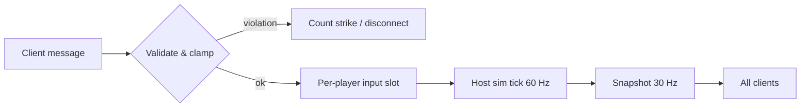

# Security

Aerocade runs entirely on a local network: a Node "LAN bridge" serves the PWA and brokers
connections, and one player's **browser** hosts the authoritative simulation
([DECISIONS.md](DECISIONS.md), ADR-006). There are no accounts, no cloud, no persistence
beyond local device settings, and nothing listens on the internet. Security work therefore
concentrates on three things: making the **host simulation the anti-cheat backbone** (every
client message is untrusted input), making **every parser crash-proof** (a hostile peer can
send arbitrary bytes), and keeping the **bridge** a hardened but dumb rendezvous point. This
document defines the threat model, the per-message validation contract, protocol and bridge
hardening rules, the privacy stance, XSS discipline, secure-context/HTTP trade-offs, and the
residual risks we accept with rationale.

## 1. Threat model

Scoped honestly for a LAN-only, no-auth party game. We defend against peers on the same
Wi-Fi, not against nation states.

### In scope

| Threat | Actor | Example | Primary defense |
|---|---|---|---|
| Cheating via forged inputs | Hostile LAN peer with a modified client build | Speed hack, fire-rate hack, infinite ammo/fuel, teleport | Host-authoritative validation (§2) |
| Protocol abuse | Any peer that can reach `:8080` | Malformed binary frames, oversized payloads, junk JSON to `/ws` | Defensive parsing + disconnect-on-violation (§3) |
| Resource exhaustion | Hostile or buggy peer | Message floods, room-spam, socket-spam against bridge or host | Rate limits, caps, idle eviction (§3, §4) |
| Griefing | Legitimate but abusive player | Offensive names, join/leave spam, spawn camping | Text-node rendering (§6), join rate limits, spawn protection (2.5 s, tuning in [physics.md](physics.md)) |
| Injection via player-controlled strings | Any peer | `<script>` in a player name shown in lobby/kill feed | XSS discipline (§6) |
| Static file server abuse | Any device on the LAN | `GET /../../etc/passwd` style traversal | Path normalization + root confinement (§4) |

### Out of scope (deliberate)

| Excluded threat | Rationale |
|---|---|
| Internet attackers | Nothing binds to a public interface by default; there is no WAN entry point. Users who port-forward the bridge do so against documented guidance (§4). |
| Persistence-layer attacks | The only storage is per-device IndexedDB (settings, keybinds, name — ADR-007). No shared database exists to attack. |
| Traffic sniffing / MITM on the LAN | Game traffic is HTTP/WS/RTC between consenting devices on a trusted home/office network. Positions and inputs of a jetpack match are not confidential. WebRTC DataChannels are DTLS-encrypted anyway; the WS relay is not. |
| Compromised host device | The host browser *is* the authority. A cheating **host** can do anything; the social fix (kick the host, re-host) is the only realistic one. Documented as residual risk (§8). |
| Denial of service by physical-layer means | Someone who can jam your Wi-Fi can stop the game. Not a software problem. |

## 2. Host-authoritative validation (the anti-cheat backbone)

The host browser owns all game state (ADR-006). Clients send **intent only** — never
outcomes. The rule is absolute: **ammo, fuel, health, position, score, and timers are
mutated exclusively by the host's simulation systems** (`input → movement → physics →
weapons → projectiles → damage → pickups → respawn → match`, ADR-005). A client message can
at most set flags and axes that the sim then interprets under its own tuning constants.

Concretely, the host's message handlers enforce, before anything touches the sim:

- **Move axes normalized.** `moveX`, `aimX/aimY` clamped to `[-1, 1]`; NaN/Infinity rejected
  (message dropped, strike counted). A client cannot request more than `1.0` of throttle —
  speed comes from `tuning.ts` (run 7.4 m/s, air accel 26 m/s²), never from the wire.
- **Fire rate enforced by host cooldowns.** The `fire` bit is a request; the weapons system
  fires only when the host-side cooldown for that player's weapon has elapsed (e.g. Vortex
  SMG 0.09 s, Longbolt 1.5 s — see [physics.md](physics.md) / weapon defs). Spamming the bit
  changes nothing.
- **Ammo / fuel / health host-mutated only.** There is no protocol message that carries these
  values client→host. Reload, jetpack burn (46 u/s), regen (30 u/s) all execute in host
  systems from host state.
- **Teleport / speed sanity checks.** Clients never send positions — prediction is local
  cosmetics; the host's snapshot is truth. Defense-in-depth: the physics step clamps
  per-tick displacement to `maxSpeed * SIM_DT` bounds and max fall (26 m/s), so even a host
  code bug cannot produce a cross-map teleport in one tick.
- **Sequence discipline.** Input sequence numbers must increase; duplicates and stale
  sequences are dropped (they are legal under reordering on the unreliable channel, so they
  are dropped silently, not punished).

### Validation checklist per message type

| Message (channel) | Field checks | Rate / size limit | On violation |
|---|---|---|---|
| `input` (unreliable, client→host) | seq: uint, monotonic per player; axes finite, clamped [-1,1]; buttons: known bitmask only; tick within ±64 of host tick | ≤ 120 msg/s per peer (2× nominal 60 Hz); fixed byte length | Drop stale/dup silently; malformed → strike; 3 strikes → disconnect |
| `join` (reliable, client→host) | name: string, ≤ 24 UTF-16 code units after trim, control chars stripped; protocol version match | 1 per connection | Reject + close channel |
| `weaponSwitch` / `reload` / `melee` intents (in input bitmask) | Valid slot index (0..roster-1); host checks ownership & cooldown | Covered by input rate | Ignore invalid slot |
| `chat`/event (reliable, client→host, M4+) | length ≤ 120 code units, control chars stripped | ≤ 2 msg/s per peer | Drop; repeated flood → disconnect |
| `snapshot` / `welcome` / `event` (host→client) | Clients validate too: bounds-check every offset before reading; unknown message id → ignore frame | n/a | Client drops frame, never crashes |
| Bridge `hello`, `room:create`, `room:list`, `room:join`, `signal`, `relay`, `pong` (JSON over `/ws`) | Schema-checked: exact `type` enum, required fields, string length caps, `signal`/`relay` payload ≤ 16 KiB, target peer must exist in the same room | Per-socket token bucket (§3) | `error` reply once, then close on repeat |

The same checklist is encoded as table-driven validators in `packages/shared` (protocol
codec) so host, client, and Vitest suites share one source of truth — see
[testing.md](testing.md) for the malformed-input fuzz cases.

## 3. Protocol robustness

Assume every byte that arrives is adversarial. The codec lives in `packages/shared`
(zero-dependency, DOM-free) and is the only code that touches raw buffers.

- **Length-prefixed binary parsing with bounds checks.** Every game frame is
  `[u8 msgId][u16 payloadLen][payload]`. The reader verifies `payloadLen` against both the
  actual buffer length and a per-message maximum before constructing any typed-array view.
  No `DataView` read may occur past a checked bound; readers track a cursor and fail closed.
- **Malformed message ⇒ disconnect, not crash.** All decode paths return a result value
  (`{ok} | {err}`) — decoding never throws across the transport boundary. On `err`, the host
  logs (dev builds only), counts a strike, and after repeated strikes closes that peer's
  transport. One hostile peer must never take down the match for the other seven.
- **JSON schema checks on bridge messages.** The bridge parses `/ws` text frames inside
  `try/catch`, then validates against hand-written schema guards (exact `type`, field types,
  length caps — no dynamic schema library; the message set is seven types, ADR-006). Unknown
  `type` → one `error` reply; repeat offenders are closed.
- **Rate limiting per socket — bridge and host.** The bridge applies a token bucket per
  WebSocket (default: 20 msg/s sustained, burst 60; `relay` frames additionally capped at
  256 KiB/s per socket since relay mode carries game traffic). The host applies the per-type
  limits from the table in §2. Limits are constants in one config object, not scattered.
- **No dynamic execution.** Nothing from the network is ever `eval`ed, used as a property
  path, or fed to `new Function`. Message ids map through a fixed lookup table.
- **Version gate.** `hello`/`join` carry a protocol version; mismatch is rejected at the door
  rather than misparsed mid-match.

## 4. Bridge hardening

The bridge (`packages/server`) is deliberately game-logic-free (ADR-006), which keeps its
attack surface enumerable: static file serving, room bookkeeping, signaling, relay.

| Concern | Rule |
|---|---|
| Bind address | Default bind is the machine's LAN interface on port 8080. Startup prints the bound address and a plain warning: "LAN use only — do not port-forward or expose this to the internet." `--host 127.0.0.1` supported for local-only testing. No UPnP, no hole punching. |
| Room codes | Generated from `crypto.randomBytes`, ≥ 48 bits of entropy, presented as 6–8 char unambiguous alphanumerics (no `0/O`, `1/l`). Guessing is unrealistic within a room's lifetime; codes are not secrets protecting anything beyond match entry. |
| Caps | Max 16 concurrent rooms, max 8 peers per room (game cap), max 64 sockets total. Exceeding a cap → `error` reply, socket closed. All caps are constants. |
| Idle eviction | Sockets that miss the ping/`pong` cycle (30 s interval, 2 misses) are closed. Rooms with zero live sockets are deleted after 60 s. Empty-but-created rooms expire after 5 min. Prevents zombie-room exhaustion. |
| Static file serving | Requests resolve against the built PWA directory only: decode URI, reject `..` and null bytes, `path.normalize`, then verify the resolved absolute path still has the web root as prefix. Anything else → 404. No directory listings, no symlink following outside the root. Content types come from a fixed extension map. |
| Payload limits | WS frames capped (64 KiB signaling, relay budget per §3); HTTP request bodies are not accepted at all (static GET/HEAD only). |
| Dependencies | The bridge keeps its dependency tree minimal (`ws` plus dev tooling); `npm audit` runs in `npm run verify` (see [testing.md](testing.md)). Fewer packages, fewer supply-chain surprises. |

## 5. Privacy stance

- **No accounts, no auth, no identifiers.** A player is a display name typed at join time.
- **Names are ephemeral.** They live in the room for the duration of the match and in the
  player's own IndexedDB for convenience. The bridge holds them in memory only and forgets
  them on room teardown.
- **No telemetry, no analytics, no crash reporting, no update pings.** The PWA is precached
  and runs offline (ADR-007). Zero third-party requests at runtime — the CSP-style
  discipline in [rendering.md](rendering.md)/[ui.md](ui.md) is "self only".
- **Nothing leaves the LAN.** There are no cloud endpoints in the codebase to send data to.
  This is verifiable by grepping for `https://` in shipped code and by watching the network
  tab: after install, the only traffic is `<lan-ip>:8080` and peer RTC.
- **Logs.** The bridge logs connection counts and room lifecycle to stdout for the person
  running it; it does not log chat or names at info level and writes nothing to disk.

## 6. XSS discipline

Player names and chat are the only attacker-controlled strings that reach the UI, and they
appear in high-traffic surfaces: lobby list, HUD, kill feed, scoreboard.

- **Text nodes only.** React's default escaping covers all DOM UI; `dangerouslySetInnerHTML`
  is banned by an ESLint rule (`react/no-danger`), as are direct `innerHTML`/
  `insertAdjacentHTML` sinks (`no-restricted-properties`). Violations fail `npm run verify`.
- **Phaser text objects** render strings as glyphs, not markup — safe by construction — but
  names still pass through the shared sanitizer first (trim, strip control characters and
  bidi overrides, clamp to 24 code units) so layout griefing (RTL flips, zero-width spam) is
  neutralized once, at the host, before broadcast.
- **QR / manual join input** (`ip:port`, room code) is parsed with strict patterns
  (`/^\d{1,3}(\.\d{1,3}){3}:\d{2,5}$/` plus range checks; code charset check) and never
  interpolated into HTML or used to build arbitrary URLs beyond the fixed
  `http://<ip>:<port>` shape.
- **Service worker scope** is the app shell only; it never caches or serves cross-origin
  responses.

## 7. Secure context, mixed content, and the HTTPS question

The bridge serves plain HTTP on the LAN (ADR-006). Browsers gate some features behind
[secure contexts](https://developer.mozilla.org/en-US/docs/Web/Security/Secure_Contexts),
which creates real, documentable friction:

| Context | What works | What degrades |
|---|---|---|
| `http://localhost:8080` (the machine running the bridge) | Everything. Browsers exempt `localhost`/`127.0.0.1` as a secure context: full PWA install, service worker, all APIs. | Nothing. |
| `http://<lan-ip>:8080` (every other device — the normal case) | Gameplay is fully functional: WebSocket, **WebRTC (`RTCPeerConnection`/DataChannels work outside secure contexts in current Chrome/Edge/Firefox)**, canvas, Gamepad API, IndexedDB. | Service worker and PWA install are unavailable (no offline cache, no "Add to Home Screen" install prompt; Android falls back to a plain shortcut). Clipboard API, `navigator.share`, and Fullscreen-adjacent niceties may be restricted; the UI feature-detects and hides those buttons. |
| `https://<lan-ip>:8080` with a self-signed cert (optional `--tls` flag) | Full secure context on every device: install, offline, all APIs. | **UX cost:** every device shows a full-page certificate warning that the player must click through; iOS additionally requires trusting the cert in Settings for service workers to register. Unacceptable as a default for a party game — shipped as an opt-in documented path, not the happy path. |

Decisions that follow from this:

- **HTTP is the default.** The core loop — join, play over RTC/WS on the LAN — needs no
  secure context on clients. We do not make eight phones click through certificate warnings
  to play one match.
- **Install/offline is positioned as a host-machine and localhost feature** until a device
  has installed the PWA at least once from a secure context. Documented in
  [../README.md](../README.md) and surfaced in-app with a one-line explainer instead of a
  broken install button.
- **No mixed content by construction:** the page, `/ws`, and all assets share one origin and
  scheme, so there are no `https://` pages loading `http://` subresources in either mode.
- The self-signed path generates a cert at first `--tls` run, prints its fingerprint, and
  never asks users to install a root CA (teaching people to trust arbitrary roots is worse
  than the warning click-through).

## 8. Residual risks (accepted)

| Risk | Why we accept it |
|---|---|
| **Cheating host.** The host browser is the authority; a modified host build can god-mode invisibly. | Any host-authoritative topology has this property; the alternative (dedicated trusted server) contradicts the "any phone can host" goal (ADR-006). Mitigation is social: visible scoreboard anomalies, kick-and-rehost. |
| **Client-side wallhacks / aim assistance.** Snapshots include all players (needed for interpolation), so a modified client can render enemies through walls or auto-aim. | Interest management (sending only visible entities) is disproportionate for a 48×27 m arena where most players are on screen anyway. LAN play is among people in the same room; social pressure is the control. |
| **Unencrypted WS relay fallback.** Relay-mode game traffic is plaintext on the LAN (RTC mode is DTLS-encrypted by the platform). | The data is game inputs and positions with no confidentiality value. Adding TLS to the relay reintroduces the §7 cert problem for zero practical gain. |
| **No identity ⇒ no bans.** A disconnected griefer can rejoin with a new name. | Any persistent identity contradicts the no-account privacy stance (§5). Room codes can be rotated by re-hosting; LAN physical proximity bounds the abuse. |
| **Bridge operator trust.** Whoever runs the bridge can log signaling metadata and relay traffic. | The bridge is run by one of the players on their own machine, from source or a published package they chose to run — equivalent trust to hosting the match itself. |
| **DoS from the local network.** Rate limits raise the floor, but a LAN peer can always saturate Wi-Fi itself. | Below the application layer; out of scope by the threat model (§1). |

Every accepted risk above is re-evaluated if scope changes — in particular, **any** future
feature that crosses the internet (online rooms, stats sync) voids this document and
requires a new ADR plus a rewritten threat model before implementation.

---

*Related: [architecture.md](architecture.md) (package boundaries), [networking.md](networking.md)
(transport, snapshot, reconciliation details), [testing.md](testing.md) (fuzz and validation
test suites), [performance.md](performance.md) (why caps are also perf guardrails).*
