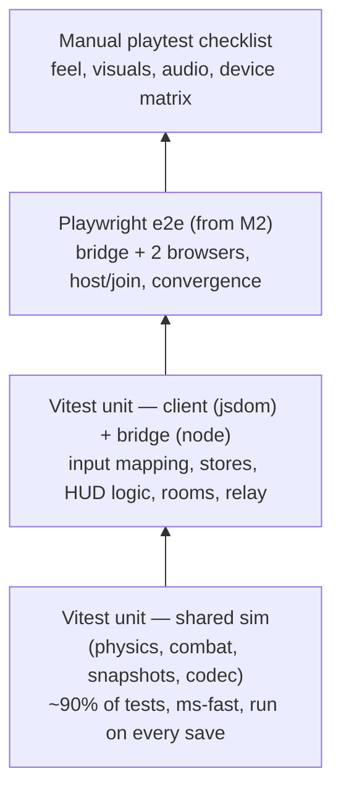

# Testing Strategy

Aerocade's testability is a direct payoff of its architecture: the entire game simulation lives in
`packages/shared` with zero dependencies and no DOM (see [architecture.md](architecture.md) and
ADR-003/ADR-009 in [DECISIONS.md](DECISIONS.md)), so the code that matters most — physics, combat,
determinism, protocol — runs headless in Vitest at thousands of ticks per second. This document
defines the test pyramid, what each layer covers, the determinism regression pattern that guards
prediction/reconciliation, the Playwright e2e plan that lands with networking in M2, the
performance regression harness, and what we deliberately leave to manual playtesting.

## Test pyramid



| Layer                   | Runner     | Environment           | Speed       | When it runs                     |
| ----------------------- | ---------- | --------------------- | ----------- | -------------------------------- |
| Shared sim unit         | Vitest     | Node (pure)           | < 5 s total | Every save, `npm run verify`, CI |
| Client unit             | Vitest     | jsdom                 | < 10 s      | `npm run verify`, CI             |
| Bridge unit/integration | Vitest     | Node + real WS        | < 15 s      | `npm run verify`, CI             |
| e2e                     | Playwright | Chromium, real bridge | ~1 min      | M2 onward, CI + pre-release      |
| Manual checklist        | Humans     | Real devices          | —           | Every milestone exit             |

The pyramid is deliberately bottom-heavy. The sim is where correctness bugs are catastrophic
(desync, rubber-banding, unfair hits) and where they are also cheapest to catch: no browser, no
timers, no network — just `(world, inputs) => world`.

## Shared sim unit tests (Vitest, `packages/shared`)

All sim tests construct a `SimWorld` from a seed and drive it tick by tick with scripted inputs.
No mocking is needed because the sim has nothing to mock — that is the point of ADR-002.

### Physics invariants

The custom physics core (see [physics.md](physics.md)) replaces Matter.js, so we own its
correctness. Tests assert invariants rather than magic positions:

| Invariant             | Test approach                                                                                                                                                                                                                          |
| --------------------- | -------------------------------------------------------------------------------------------------------------------------------------------------------------------------------------------------------------------------------------- |
| No tunneling          | Fire the fastest mover (Thumper rocket, 24 m/s = 0.4 m/tick) and a player at max fall speed (26 m/s ≈ 0.43 m/tick) at a 1-tile-thin wall/floor from many offsets; assert the swept AABB/ray never ends up inside or past a solid tile. |
| Corner resolution     | Drive the 0.85 × 1.65 m player AABB diagonally into inner and outer tile corners; assert no jitter oscillation across ticks, no penetration, and axis-correct velocity zeroing.                                                        |
| Ceiling/floor contact | Jump (8.6 m/s) under a low ceiling: vertical velocity clamps to 0 on contact, never reflects.                                                                                                                                          |
| Max fall clamp        | Free-fall from height: `vy` never exceeds 26 m/s regardless of tick count.                                                                                                                                                             |
| Rest stability        | A grounded, idle player stays bit-identical in position for 600 ticks (no micro-sliding from friction/gravity interplay).                                                                                                              |
| Explosion overlap     | Circle-vs-AABB queries (Thumper r=3.2, Lobber r=2.8, Frag r=3.4) tested at edge/corner tangency — inclusive/exclusive boundary behavior is pinned by test, not by accident.                                                            |

### Movement, jetpack, and fuel timing

Tuning constants come from `sim/tuning.ts`; tests reference them symbolically so a deliberate
retune doesn't break tests, while timing _relationships_ are pinned exactly:

- Ground run reaches 7.4 m/s under 55 m/s² accel; air accel capped at 26 m/s²; friction 48
  decays to rest without sign flip-flop.
- Full fuel tank (100) at burn 46/s empties in `ceil(100/46 / SIM_DT)` ticks — asserted in ticks,
  not seconds, so the test is exact.
- Fuel regen (30/s) starts only after the 0.6 s delay (36 ticks) of no thrust; thrusting for a
  single tick resets the delay.
- Hover mode: while thrusting with `|vy| < 1.5`, burn drops to 20/s and altitude holds within a
  small epsilon over 300 ticks.
- Jetpack thrust (38 m/s²) beats gravity (21 m/s²): a full tank gains altitude, and net upward
  accel matches `thrust − gravity` exactly on unobstructed ticks.

### Weapons, reload, spread — deterministic by seed

Weapon math (see roster in [../README.md](../README.md) and defs in
`sim/combat/weapon-defs.ts`) is tested per weapon:

- **Cycle/reload timing in ticks:** Rivet Pistol fires at most once per `round(0.28/SIM_DT)`
  ticks; holding fire through a 12-round mag triggers reload exactly on the 13th attempt.
- **Spread determinism:** two `SimWorld`s with the same seed produce bit-identical Scattergun
  pellet angles (8 pellets, 11°) and Vortex SMG bloom sequences. A different seed produces a
  different sequence (guards against a constant-spread regression that would fake determinism).
- **Falloff:** Scattergun pellet damage attenuates beyond 14 m per the falloff curve; table-driven
  test at 0 m / 14 m / max range.
- **Hitscan vs projectile:** Longbolt ray reports first-hit tile/player correctly through gaps;
  Lobber projectile follows a deterministic arc (16 m/s launch, gravity) and detonates on the
  exact fuse tick (2.0 s = 120 ticks) or on impact, whichever is first.
- **Spawn protection interaction:** firing any weapon clears the 2.5 s spawn protection on the
  firing tick.

### Damage, knockback, respawn

- Damage tables: direct hits apply listed damage; splash scales with distance (Thumper 40 direct
  - up to 55 splash asserted at epicenter and at r=3.2 edge → 0).
- Knockback vectors point away from the impulse source; Longbolt and Frag apply their high
  knockback values; a self-aimed Thumper at the floor produces upward velocity (the rocket-jump
  contract — this is a _feature test_, not incidental).
- Kill → corpse cleanup → respawn exactly `3 s / SIM_DT` ticks later at a spawn point, with
  health 100, spawn protection 2.5 s, and protection cleared early by firing.
- Melee Spanner Strike: hits only within the 1.3 m arc, respects the 0.5 s cycle.

### Snapshot round-trip equality

Snapshots are typed-array copies (ADR-004). Tests run a seeded match ~300 ticks with scripted
inputs, snapshot it, mutate the live world further, restore the snapshot, and assert
**bit-for-bit equality** of every pool array against a reference copy — including `alive` flags,
RNG state, and tick counter. A snapshot that forgets one array is a desync factory; this test is
the tripwire. The 64-tick rewind ring used for lag compensation (see
[networking.md](networking.md)) reuses the same snapshot code and inherits this guarantee.

### Protocol codec round-trip and malformed input rejection

Every wire message (input frames, delta snapshots, join/welcome/events, and the bridge JSON
messages `hello`, `room:create`, `room:list`, `room:join`, `signal`, `relay`, `error`, `pong`)
gets two test families:

1. **Round-trip:** `decode(encode(msg))` deep-equals `msg` for representative and boundary values
   (max players, full projectile pool, empty deltas, max-length names).
2. **Hostile input:** truncated buffers, wrong type tags, out-of-range entity ids, NaN floats,
   over-long strings, and random fuzz bytes must throw a typed `DecodeError` or return a rejection
   — never crash, never partially apply. The host validates before applying (see
   [security.md](security.md)); the codec tests are the first line of that defense.

Delta snapshot encoding additionally gets an idempotence test: applying a delta to the baseline it
was computed from reproduces the source snapshot exactly.

## Determinism regression pattern

The single most valuable test in the repo. ADR-009's rules (seeded mulberry32, no wall clock,
ascending-index iteration) are enforced by construction, then _verified_ by replay:

```ts
test('sim is deterministic for a fixed seed and input script', () => {
  const script = recordedInputScript; // checked-in: 8 players, 1800 ticks of varied inputs
  const hashA = hashWorld(runSim(createWorld({ seed: 0xc0ffee, map: 'foundry' }), script));
  const hashB = hashWorld(runSim(createWorld({ seed: 0xc0ffee, map: 'foundry' }), script));
  expect(hashA).toBe(hashB); // replay-stable
  expect(hashA).toBe(GOLDEN_HASHES.foundry); // regression-stable across commits
});
```

- `hashWorld` is FNV-1a over every pool's underlying bytes plus RNG state and tick — cheap and
  order-stable.
- The checked-in **golden hash** turns any accidental nondeterminism (a stray `Math.random`, an
  object-key iteration, a reordered system) into a red test with a one-line diff.
- When a _deliberate_ tuning or logic change lands, the golden hash is updated in the same commit
  — the diff makes the behavioral change explicit in review.
- Input scripts are recorded from real play in the M1 sandbox and stored as compact JSON; several
  scripts cover movement-heavy, combat-heavy, and explosion-heavy profiles.
- Per ADR-009 this asserts _practical_ determinism (same engine replaying its own inputs — what
  prediction/reconciliation needs), not cross-machine lockstep.

## Client unit tests (Vitest + jsdom, `packages/client`)

Phaser is never imported in these tests. Targets are the pure/DOM-light client layers:

- **Input mapping:** keyboard/mouse state → the sim's input frame struct (WASD composition,
  aim-angle math from pointer position, buffered edge-triggered actions like reload and weapon
  switch). Twin-stick mapping (M5): stick vectors → move/aim, right-stick deadzone threshold
  gating fire.
- **Stores:** settings/keybind persistence (IndexedDB mocked), room-list state, connection state
  machine transitions (idle → discovering → joining → connected → dropped).
- **HUD logic:** pure selectors that derive HUD view-model from sim state — health/fuel bar
  fractions, ammo and reload progress, killfeed ordering, scoreboard sort, respawn countdown.
  Rendering of those values is _not_ asserted (see below).

## Bridge server tests (Vitest, `packages/server`)

The bridge is game-logic-free (ADR-006), so its tests are small and infrastructural, run against
a real WebSocket server on an ephemeral port:

- **Room lifecycle:** `room:create` → appears in `room:list`; join caps at 8; host disconnect
  closes the room and notifies members; stale rooms are reaped.
- **Signaling relay:** `signal` payloads route only between the two intended peers, opaque to the
  bridge; misaddressed signals produce `error`, not a crash.
- **Relay fallback:** `relay` frames forward with per-room isolation; a client cannot relay into
  a room it never joined.
- **Socket hygiene:** abrupt TCP drops, half-open sockets (missed `pong`), and malformed JSON all
  result in cleanup — no leaked room entries, no writes to dead sockets. Asserted by inspecting
  bridge state after each abuse case.

## Playwright e2e (from M2)

E2e lands with M2, not M1, by design (ADR-010): M1 is a single-browser local sandbox whose logic
is already fully covered by sim unit tests — a browser-automation harness would add CI weight and
flake while asserting nothing the unit layer doesn't. E2e earns its cost only once there are two
browsers and a network between them, because transport negotiation, prediction/reconciliation,
and snapshot flow are exactly the seams unit tests cannot cross.

The M2 suite, in order of value:

1. **Boot:** start the bridge programmatically, wait for `http://<lan-ip>:8080` to serve the PWA.
2. **Host + join:** two isolated browser contexts; context A creates a room, context B discovers
   it via the room list and joins; assert both reach the in-match state over the preferred RTC
   transport (and a variant run forces the WS relay fallback path).
3. **Convergence:** after a scripted burst of movement on both sides, poll an exposed debug hook
   (`window.__aerocade.debugState()`) and assert host and client agree on player positions within
   the interpolation-buffer tolerance.
4. **Kill registers end-to-end:** context A fires at context B's known position; assert B's death
   event, A's score increment on _both_ scoreboards, and B's respawn after 3 s.
5. **Disruption (M2 stretch):** drop the client's transport mid-match and assert the fallback or
   rejoin path recovers without a host crash.

Playwright and its browsers are not installed as dependencies until M2 to keep `npm install` and
CI lean during M0/M1.

## Performance regression harness

Because the sim is headless, throughput is benchmarkable in CI (details and budgets in
[performance.md](performance.md)):

```ts
bench('foundry, 8 players, combat-heavy script', () => {
  runSim(createWorld({ seed: 1, map: 'foundry' }), combatScript); // 3600 ticks
});
// Budget assertion: ticks/sec must exceed 60 × SAFETY_FACTOR (e.g. 50×)
```

- Runs the standard input scripts for 3600 ticks (1 minute of sim) and reports ticks/second.
- A budget assertion fails the run if throughput drops below a generous multiple of real-time —
  headroom exists because the host browser must sim + render + network on mid-range Android.
- A second assertion tracks **zero allocation during a match**: heap usage sampled before/after N
  ticks must be flat (guards ADR-004's preallocated-pools contract against accidental per-tick
  garbage).
- Budgets are deliberately loose enough to ignore CI noise but tight enough to catch an
  accidental O(n²) or a deopt from a polymorphic hot path.

## Deliberately not unit tested

| Area                                                     | Why not                                                                   | Covered instead by                                              |
| -------------------------------------------------------- | ------------------------------------------------------------------------- | --------------------------------------------------------------- |
| Phaser rendering internals                               | Third-party, canvas/WebGL, no DOM in jsdom; mocking Phaser tests the mock | Manual checklist + e2e smoke (canvas exists, no console errors) |
| Visual output (sprites, particles, screen shake)         | Pixel assertions are flaky and freeze art iteration                       | Manual playtest checklist per milestone                         |
| Audio                                                    | "sounds right" is human judgment; the rest is measurable                  | Unit tests + a headless browser check, then a manual pass       |
| Real device input feel (touch latency, stick ergonomics) | Emulation lies about touch                                                | Device-matrix playtest (M5)                                     |
| Real Wi-Fi behavior (AP isolation, roaming)              | Not reproducible in CI                                                    | Documented manual LAN test in [networking.md](networking.md)    |

Each milestone exit includes a written **manual playtest checklist** (kept beside this doc):
movement feel at 60/144 Hz displays, jetpack/hover behavior, rocket-jump feel, every weapon's
audio-visual feedback, HUD readability on a small phone, and — from M2 — a two-device LAN session
on real hardware. Checklist items are pass/fail with a named tester; failures become issues, not
memories.

## `npm run verify` and pre-commit discipline

`npm run verify` is the single quality gate (ADR-010) and must be green before every commit:

```
verify = typecheck (tsc --noEmit, strict) → lint (ESLint) → format check (Prettier)
         → test (Vitest, all workspaces) → build (all packages)
```

- Runs identically locally and in CI — no CI-only steps, so "works on my machine" cannot diverge.
- From M2, CI additionally runs the Playwright suite and the performance harness; both are kept
  out of the local `verify` to preserve its sub-minute feedback loop.
- Golden determinism hashes and tuning constants change **in the same commit** as the code that
  changes them, never in follow-ups — the review diff must tell the whole story.
- New sim systems land with their invariant tests in the same PR; a physics or combat change
  without a test delta is a review flag by convention.
