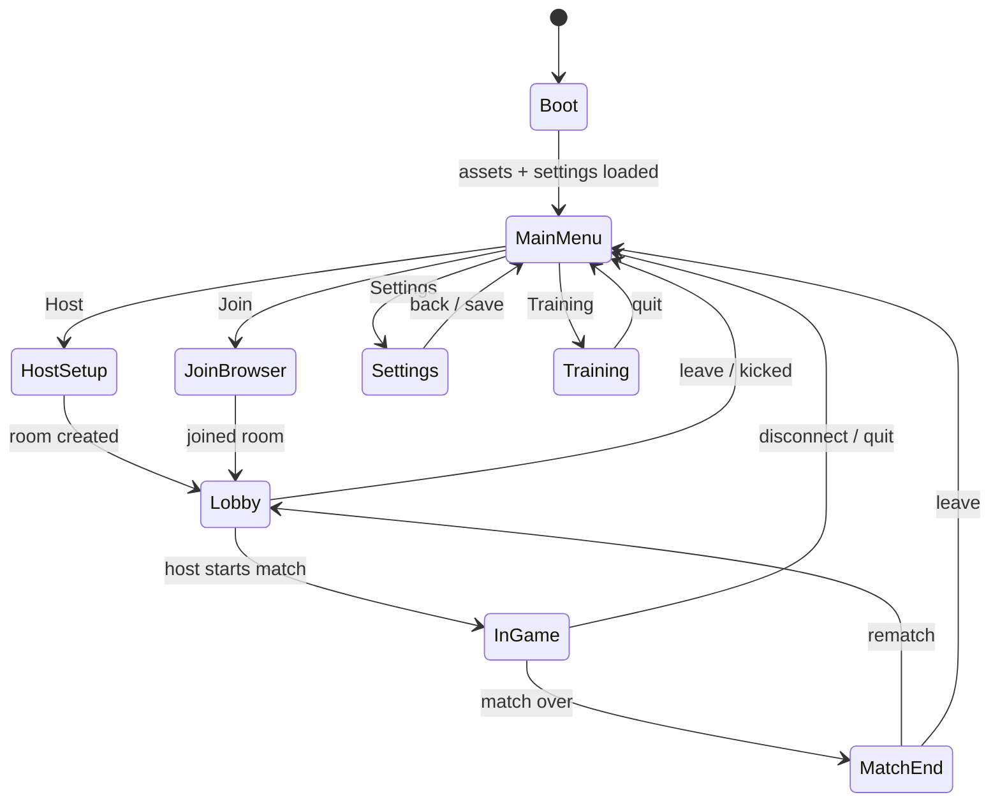

# UI Architecture

Aerocade's UI is a plain React 19 DOM layer stacked above the Phaser canvas. React owns every
pixel outside the game world — menus, lobby, HUD, touch controls — while Phaser renders only the
simulation (see [rendering.md](rendering.md) and [architecture.md](architecture.md)). The two are
bridged by a thin, dependency-free store built on `useSyncExternalStore`, with strict update-cadence
rules so React never renders on the game loop's schedule. This document specifies the screen state
machine, the store contract, HUD composition and its refresh policy, the mobile twin-stick control
layer, settings persistence, the join flow, and the accessibility baseline.

## 1. Why DOM for UI (not in-canvas UI)

We deliberately render zero UI inside the Phaser canvas:

| Concern | DOM/React | In-canvas UI |
| --- | --- | --- |
| Text layout, wrapping, i18n-ready fonts | Free (browser layout engine) | Hand-rolled bitmap/text metrics |
| Touch targets, focus, keyboard navigation | Native semantics, `:focus-visible` | Reimplement hit testing + focus |
| Accessibility (screen readers, zoom, contrast) | ARIA + real elements | Effectively opaque |
| Safe-area insets on notched phones | `env(safe-area-inset-*)` CSS | Manual viewport math |
| Iteration speed | HMR via Vite, CSS | Recompile scene layout code |
| Cost when idle | Zero draw calls to the game | UI competes with game batching |

The canvas draws the world; DOM draws everything about the world. The one rule that keeps this
cheap: **React must never re-render at frame rate** (§4). Forms, lists, and QR codes are exactly
what browsers are good at; a WebGL sprite batcher is exactly what they are not.

The HUD layer sets `pointer-events: none` at its root and re-enables it per interactive element,
so mouse aim over the canvas is never stolen by an overlay.

## 2. Screen state machine

Navigation is a small explicit state machine — not a URL router. The PWA is a single fullscreen
app; browser history integration is limited to `Esc`/back mapping to the machine's `back` event.



Screen semantics:

| Screen | Owns | Notes |
| --- | --- | --- |
| `Boot` | PWA install prompt state, settings hydration from IndexedDB | No user input; sub-second |
| `MainMenu` | Top-level nav, player name summary | Shows bridge connectivity dot (connected / searching) |
| `HostSetup` | Room name, mode (FFA/TDM), map, player cap | Creates room via bridge `room:create` ([networking.md](networking.md)) |
| `JoinBrowser` | Room list, manual `ip:port`, QR scan/share | §7 |
| `Settings` | All persisted options | §6 |
| `Training` | Offline solo sandbox on Foundry | Runs the full sim locally; no bridge required |
| `Lobby` | Roster, ready states, team assignment, chat | Reliable-channel events only |
| `InGame` | HUD + pause overlay + touch controls | §4, §5 |
| `MatchEnd` | Final scoreboard, per-player stats, rematch vote | Data is the last match snapshot; static |

Transitions are driven by store events, never by components mutating navigation state directly:
the net layer dispatches `room:joined`, the sim dispatches `match:ended`, and the machine reduces
them. Illegal transitions are dropped and logged in dev builds. `InGame → MainMenu` on disconnect
routes through a toast explaining why (host left, transport lost) — silent ejection is a bug.

## 3. The UI store

No external state library. `packages/client/src/ui/store.ts` implements one pattern:

```ts
interface UiStore<S> {
  getSnapshot(): S;                       // stable reference until something changed
  subscribe(cb: () => void): () => void;  // returns unsubscribe
  dispatch(event: UiEvent): void;         // the ONLY way state changes
}
```

Components consume slices via `useSyncExternalStore(store.subscribe, () => selectX(store.getSnapshot()))`,
wrapped in typed hooks (`useHud()`, `useScreen()`, `useRoster()`). Rules:

- **Immutable snapshots.** `dispatch` produces a new state object; unchanged slices keep referential
  identity so selector-based hooks skip re-renders for free.
- **One-way bridge.** Sim and net code never import React. They call `store.dispatch(...)` with
  plain events (`hud:damage`, `net:ping`, `match:kill`, `room:list`). The store is a `shared`-style
  pure module and is unit-tested headless ([testing.md](testing.md)).
- **UI → game is commands, not state.** Menus call imperative game-facade methods
  (`game.startTraining()`, `net.joinRoom(id)`); they never reach into `SimWorld`. The ECS remains
  the single owner of gameplay state ([ecs.md](ecs.md)).
- **No sim data mirrored wholesale.** The store holds *presentation* state only: the HUD slice is
  a handful of numbers, not entity pools.

Why not Zustand/Redux: the store is ~120 lines, has zero dependencies (matching the project's
lean-deps stance, ADR-002 in [DECISIONS.md](DECISIONS.md)), and its event log doubles as a test
fixture format.

## 4. HUD composition and update cadence

The HUD is one absolutely-positioned layer over the canvas:

| Element | Data source | Update trigger |
| --- | --- | --- |
| Health bar + number | Local player pool slot | 10 Hz poll + `hud:damage` event (instant on hit) |
| Fuel gauge | Jetpack fuel value | 10 Hz poll (fuel drains smoothly; CSS transition tweens between polls) |
| Ammo `mag / reserve` + reload spinner | Weapon state | Event-driven: `weapon:fired`, `weapon:reload`, `weapon:switch` |
| Weapon icon + name | Equipped weapon id | Event-driven on switch |
| Kill feed (last 5, 6 s TTL) | `match:kill` events | Event-driven; entries expire on a 1 Hz sweep |
| Match timer + score summary | Match system | 1 Hz poll |
| Ping indicator | Transport RTT estimate | 1 Hz poll ([networking.md](networking.md)) |
| Hit markers / damage direction arcs | `hud:hit`, `hud:damaged` events | Event-driven, self-expiring via CSS animation |
| Scoreboard | Roster + per-player stats | Mounted only while `Tab` held (desktop) or scoreboard button held (mobile); 2 Hz while visible |
| Spawn-protection ring / respawn countdown | Respawn system events | Event-driven |

**The cadence rule (load-bearing):** React renders are *never* driven per frame. Two mechanisms
feed the HUD, and nothing else:

1. **Events** for discrete facts (kills, hits, reloads, weapon switches) — dispatched by sim/net
   the tick they happen, batched within a microtask so one tick's events cause at most one render.
2. **A 10 Hz poller** for continuously varying values (health, fuel, ammo count). The poller reads
   the latest interpolated sim state, compares against the previous HUD slice field-by-field, and
   dispatches only on change. Equal values produce zero renders.

Anything that must animate smoother than 10 Hz (fuel bar, crosshair bloom) animates in CSS between
data points, or lives in the canvas instead. This keeps React reconciliation entirely off the hot
path — the frame budget belongs to the sim and renderer ([performance.md](performance.md)).

## 5. Mobile twin-stick control layer

Touch controls are React components in the HUD layer that write into the same `InputFrame` the
keyboard/mouse mapper produces — the sim cannot tell input sources apart (see
[architecture.md](architecture.md) for the input pipeline; controls listed in
[../README.md](../README.md)).

### Virtual joystick spec (both sticks)

- **Touch zones:** left 40% of the viewport = move stick, right 40% = aim stick, center 20% dead
  strip avoids accidental grabs. Zones exclude the button cluster's bounds.
- **Dynamic origin:** the stick center spawns where the finger lands (no fixed base); a faint
  ghost ring shows the origin. Origin re-anchors if the finger drags beyond 1.6× the stick radius
  ("follow" mode), so long swipes never pin the stick to a stale center.
- **Radius / deadzone:** visual radius 64 px × layout scale; input radius clamps at that. Radial
  deadzone 18% — below it the stick reports zero; above it, output is re-normalized from the
  deadzone edge so there is no jump at the threshold.
- **Move stick:** X axis maps to run direction with analog magnitude (walk below 0.55 deflection,
  run above — matching the 4.2 / 7.4 m/s tiers); pushing up ≥ 0.6 is an alternate jetpack input.
- **Aim stick + fire threshold:** direction sets aim angle continuously. Deflection past the
  **fire threshold (75% of radius)** holds the fire input; dropping below 65% releases it
  (hysteresis prevents fire stutter at the boundary). Aiming without firing is the 18–75% band.

### Button cluster

Right-edge column above the aim zone, thumb-reachable, 56 px min touch targets at scale 1.0:

| Button | Action | Behavior |
| --- | --- | --- |
| Jetpack | Thrust while held | Largest button; also mapped to move-stick up |
| Grenade | Frag grenade | Tap = quick throw; hold shows a simple power arc, release throws |
| Reload | Reload | Pulses when mag is empty |
| Switch | Next weapon | Shows current weapon icon |
| Melee | Spanner Strike | Placed nearest the aim zone for panic reach |

All touch handlers use pointer events with `touch-action: none` on the control layer, capture the
pointer id, and tolerate up to 5 concurrent touches (two sticks + buttons).

### Safe areas and orientation

- The control layer pads by `env(safe-area-inset-*)` so sticks and buttons never sit under notches,
  home indicators, or rounded corners; the HUD applies the same insets.
- The PWA manifest requests landscape (ADR-007). Where the browser ignores it, a portrait overlay
  ("Rotate your device") blocks input with a rotation glyph; the game auto-pauses in Training and
  keeps simulating in networked play (the host does not stop for one player's orientation).

## 6. Settings

Single scrollable screen, grouped; every change is applied live and persisted to IndexedDB
(`aerocade/settings`, versioned record with migration on schema bumps — per ADR-007, no cloud,
no accounts):

| Group | Settings |
| --- | --- |
| Player | Display name (max 16 chars, shown in lobby/kill feed) |
| Input | Mouse/aim-stick sensitivity (0.5–2.0×), full keybind remapping table, gamepad bindings |
| Layout | HUD/control scale (0.8–1.4×), left-handed mode (mirrors sticks and button cluster) |
| Audio | SFX volume, music volume (0–100, independent) |
| Access | Colorblind-safe team palette toggle, reduced screen-shake toggle |

Keybind capture uses a "press any key" modal listening on `KeyboardEvent.code` (layout-independent),
rejects duplicates with an inline conflict warning, and offers per-binding and global reset to
defaults. Settings load during `Boot`; a corrupt record falls back to defaults rather than blocking
entry.

## 7. Join flow UX

Ordered by friction; the design constraint is that browsers cannot discover peers by broadcast
(ADR-006), so first contact needs the bridge's address by some channel:

1. **Auto-discovery (default):** clients that loaded the PWA from the bridge already know the
   bridge origin; `JoinBrowser` subscribes to `room:list` and renders live cards — room name, host
   name, mode, map, player count `n/8`, a ping estimate. Tap to join. Empty state explains "waiting
   for a host on this network" rather than showing a blank list.
2. **Manual entry:** an `ip:port` field (prefilled with the last successful address) for devices
   that opened the PWA from cache or another origin. Validation is inline; failure states
   distinguish "bridge unreachable" from "room gone".
3. **QR share:** `HostSetup` and the `Lobby` render a QR code of `http://<lan-ip>:8080/#room=<id>`
   (generated locally — no external service, consistent with the offline guarantee). A joining
   phone scans it with its camera app, loads the PWA from the bridge, and deep-links straight into
   the room join handshake.

Join progress is explicit: `contacting bridge → joining room → negotiating transport → in lobby`,
with the transport step surfacing the RTC-vs-relay outcome as a small badge (details in
[networking.md](networking.md)). Every failure has a retry affordance and a plain-language reason.

## 8. Accessibility

- **Color-safe teams:** team identity is never color-alone — palettes are chosen for deuteranopia/
  protanopia separability, and player markers add shape (chevron vs. ring) and name labels. The
  colorblind toggle (§6) swaps to a high-separation palette.
- **Scalable HUD:** all HUD and touch-control sizing derives from one `--hud-scale` CSS custom
  property (0.8–1.4×); text uses `rem` so browser/OS font scaling compounds sensibly.
- **Contrast:** HUD text and gauges maintain ≥ 4.5:1 against a worst-case backdrop via a subtle
  scrim behind text elements, tested against the brightest Foundry areas.
- **Motion:** the reduced screen-shake setting also honors `prefers-reduced-motion` by default.
- **Menus are real DOM:** every pre-game screen is keyboard-navigable with visible focus and
  labelled controls; gamepad navigation maps to the same focus order. In-match gameplay is
  inherently visual/temporal; the accessibility investment targets everything around it.

## 9. Testing hooks

Store reducers, selectors, the screen state machine, and the joystick math (deadzone
renormalization, fire-threshold hysteresis, dynamic-origin re-anchoring) are pure functions with
Vitest coverage under jsdom; Playwright (M2+) drives the real join flow end-to-end. See
[testing.md](testing.md). Milestone placement: HUD lands in M1, join/lobby in M2, scoreboard and
match-end in M4, the mobile control layer and settings in M5 ([roadmap.md](roadmap.md)).
